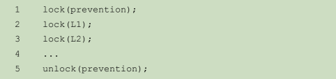

# 操作系统导论
##### 操作系统介绍
操作系统让程序变得更易用，允许程序共享内存，让程序能够和设备交互。要做到这一点，操作系统用到的一个主要的通用技术是虚拟化。更确切的来说，操作系统将物理资源(如cpu，内存，硬盘)转换为更通用、更强大、更易于使用的虚拟形式(文件描述符fd)。

##### 操作系统设计目标
1. 建立一些抽象，让操作系统方便和易于使用
2. 提供高性能换言之就是最小化操作系统的开销
3. 应用程序之间以及应用程序和操作系统之间应该提供保护，最基本的核心思路就是隔离
4. 操作系统本身必须不间断的运行以提供服务。

# 第一部分 虚拟化
## 虚拟化cpu：进程
操作系统通过虚拟化（virtualizing）CPU 来提供这种假象。通过让一个进程只运行一个时间片，然后切换到其他进程，操作系统提供了存在多个虚拟 CPU 的假象。这就是时分共享（time sharing）CPU 技术，允许用户如愿运行多个并发进程。
空分共享是指资源在空间上被划分给希望使用它的人。例如，磁盘空间自然是一个空分共享资源，因为一旦将块分配给文件，在用户删除文件之前，不可能将它分配给其他文件。

### 进程的概念
首先理解进程的机器状态。在任何时刻，机器的哪些部分对执行该程序很重要？
进程的机器状态有一个明显组成部分，就是它的内存。指令存在内存中。正在运行的程序读取和写入的数据也在内存中。因此进程可以访问的内存（称为地址空间，address space）是该进程的一部分。
进程的机器状态的另一部分是寄存器。许多指令明确地读取或更新寄存器，因此显然，它们对于执行该进程很重要。

### 进程的一些API
* 创建：操作系统必须包含一些创建新进程的方法。
* 销毁：由于存在创建进程的接口，因此系统还提供了一个强制销毁进程的接口。
* 等待：有时等待进程停止运行是有用的，因此经常提供某种等待接口。主要是可以控制进程间的执行顺序
* 其他控制：例如，大多数操作系统提供某种方法来暂停进程
* 状态：通常也有一些接口可以获得有关进程的状态信息，例如运行了多长时间，或者处于什么状态。

### 进程创建：更多细节
操作系统运行程序必须做的第一件事是将代码和所有静态数据（例如初始化变量）加载（load）到内存中，加载到进程的地址空间中。现代操作系统惰性（lazily）执行该过程，即仅在程序执行期间需要加载的代码或数据片段，才会加载。
随后给运行时栈分配资源，包含main函数等
可能还会给程序分配堆资源
除此之外还将执行一些初始化任务，特别是输入输出相关的任务，例如，在 UNIX 系统中，默认情况下每个进程都有 3 个打开的文件描述符（file descriptor），用于标准输入、输出和错误。

### 进程的状态
* 运行：在运行状态下，进程正在处理器上运行。
* 就绪：在就绪状态下，进程已准备好运行，但由于某种原因，操作系统选择不在此时运行。
* 阻塞：在阻塞状态下，一个进程执行了某种操作，直到发生其他事件时才会准备运行
* 初始：表示进程在创建时处于的状态
* 最终（final）：一个进程可以处于已退出但尚未清理的最终（final）状态（在基于 UNIX 的系统中，这称为僵尸状态）。这个最终状态非常有用，因为它允许其他进程（通常是创建进程的父进程）检查进程的返回代码，并查看刚刚完成的进程是否成功执行

### 进程API
* fork()系统调用：系统调用fork用于创建**新进程**，注意进程和线程的区别。其中在父进程中，fork函数的返回值是子进程的进程号，而在子进程中，fork的返回值是0。(可以通过函数返回值区分子进程和父进程，从而执行不同的任务)
* wait()系统调用：有谁谁父进程需要等待子进程执行完毕，这很有用。这项任务由 wait()系统调用（或者更完成的兄弟接口waitpid()）
* exec()系统盗用：exec()系统调用，它也是创建进程 API 的一个重要部分。这个系统调用可以让子进程执行与父进程不同的程序
* 为什么这样设计API：这三个接口也基本能够实现一个简单的shell ，通过fork和exec创建指定运行的新进程，通过wait调度子进程优先执行,然后继续执行父线程/shell的任务从而继续执行终端。

### 程序执行的机制：受限直接执行
#### 受限制直接执行
* 直接执行
直接执行的明显优势是快速。该程序直接在硬件 CPU 上运行，因此执行速度与预期的一样快。但是直接在cpu上运行会带来一个问题，进程希望执行某种受限制操作，比如争抢CPU或内存，那么很可能威胁到操作系统或其他程序的运行。
* 用户模式和内核模式(用户态和内核态)
因此，我们采用的方法是引入一种新的处理器模式，称为用户模式（user mode）。在用户模式下运行的代码会受到限制。
与用户模式不同的内核模式（kernel mode），操作系统（或内核）就以这种模式运行。在此模式下，运行的代码可以做它喜欢的事，包括特权操作，如发出 I/O 请求和执行所有类型的受限指令
* 系统调用
如果处于用户模式用户程序想要执行某种特权操作，那么就需要执行系统调用，执行特殊的陷阱指令，该指令同时跳入内核模式并将特权级别提升至内核模式。由于内核模式执行的是操作系统的代码，所以这里需要保存用户的状态，等到陷阱指令返回之后还需要恢复用户状态。(执行IO可能先到缓冲区，以免因为频繁的上下文切换导致系统利用率不足)
* 其他
1.内核通过在启动时设置陷阱表（trap table）来实现在碰到陷阱指令的时候执行什么代码，每个系统调用都有一个唯一的整数号，代表其对应陷阱表的偏移量。
2.Read()之类的编程语言库函数看起来像是普通的函数调用而非系统调用，因为其内部执行了系统调用，是封装的一种

#### 进程间切换
* 协作方式：等待系统调用，在用户程序发起系统调用的时候操作系统重新获得cpu的使用权，但是问题在于如果恶意用户进程不发出系统调用或者用户进程进入了死循环，则os永远不能获得cpu的操作权（或许只有重启一条路）。
* 非协作方式：利用时钟中断重新获得控制权。这里发生时钟中断需要保留当前程序的状态（另外时钟是可以关闭的,特权操作）
* 保存和恢复上下文
如果决定进行切换，OS 就会执行一些底层代码，即所谓的上下文切换（context switch）。为了保存当前正在运行的进程的上下文，操作系统会执行一些底层汇编代码，来保存通用寄存器、程序计数器，以及当前正在运行的进程的内核栈指针，然后恢复寄存器、程序计数器，并切换内核栈，供即将运行的进程使用。**通过切换栈，内核在进入切换代码调用时，是一个进程（被中断的进程）的上下文，在返回时，是另一进程（即将执行的进程）的上下文。当操作系统最终执行从陷阱返回指令时，即将执行的进程变成了当前运行的进程**。至此上下文切换完成。

#### 中断实际是什么
* 中断由处理器外部的硬件产生，不是执行某条指令的结果，也无法预测发生时机。由于中断独立于当前执行的程序，因此中断是异步事件，每个中断都有一个中断号。操作系统使用中断描述符表（Interrupt Descriptor Table，IDT）来保存每个中断的中断处理程序的地址。当发生中断时，操作系统会根据中断号，在中断描述表中查找并执行相应的中断处理程序。当处理程序返回后，进程续执行下一条指令，就好像没有发生过中断一样。
* 不是外界事件首先引发了中断跳转，跳转时顺便置上中断标志，而是外界事件导致置上了中断标志，然后中断标志再进一步引发了跳转。(注意这里的先后顺序)
* 标志置上了并不等于立即就会引发跳转。标志本身只是用来看的，就是说，得等CPU看到这个标志，才能真正引发跳转。
* 触发中断的，实质上既不是外部设备，也不是标志，而是CPU自己。CPU只在每个指令周期的开头瞅一眼中断标志，有，则进入处理过程，没有，则继续做它自己的事。如果不巧，标志置晚了，CPU已经瞅完了，那就只能等下一轮指令周期
* 当CPU瞅到了一个标志、并进入其处理过程之时，还会自己给自己戴个眼罩，此时哪怕还有别的标志，也瞅不见了，所以此时别的中断发生，也得不到处理。当CPU处理完了这个中断，会自己把眼罩摘掉，于是又能愉快的瞅标志了。如果有别的标志正巧竖在那，那就处理吧。
* 如果cpu已经开始处理一个中断，此时新的中断的标志根据标志的不同可能有两种可能，一种是被擦除，一种是需要程序手动清除。对于没有擦除的中断，操作系统可能会重复执行中断直到被擦除为止。

#### 中断和陷阱指令对比

### 进程调度
首先明确三种时间概念
* 执行时间：任务实际完成需要的CPU时间
* 周转时间：完成时间 - 到达时间
* 响应时间：首次运行时间 - 到达时间(注意，这里的响应不是任务执行完毕而是首次执行)

#### 进程调度的经典算法
* 先进先出(FIFO)
FIFO 有一些积极的特性：它很简单，而且易于实现。
缺点：如果先来的任务执行时间长，则后来的短任务必须等待先来的长任务全部执行完毕才能执行，导致周转时间非常长。

* 短任务优先(SJF)
优点：如果所有任务同时到达，则周转时间达到最短
缺点：如果长任务先到达并且已经执行，则必须等待长任务执行完毕

* 最短完成时间优先(STCF):剩余任务少优先
优点：利用调度器执行上下文切换，不论谁先来，都能实现周转时间最优
缺点：响应时间不是很好，长任务可能饿死，迟迟不能使用cpu

* 轮询
优点：响应时间短
缺点：时间片如何设置不好可能导致频繁上下文切换，同时可能导致周转时间降低(每个任务都只有一些时间片，导致整体完成时间后延)

* 其他
这里的算法都是单纯认为所有的用户请求都只是需要cpu时间，不考虑IO因素。与此同时，实际的调度程序没有办法知道各个任务实际需要多少计算时间(比如挖个矿啥的)。

### 多级反馈队列
* 规则 1：如果 A 的优先级 > B 的优先级，运行 A（不运行 B）。
* 规则 2：如果 A 的优先级 = B 的优先级，轮转运行 A 和 B。
* 规则 3：工作进入系统时，放在最高优先级（最上层队列）。
* 规则 4：一旦工作用完了其在某一层中的时间配额（无论中间主动放弃了多少次CPU），就降低其优先级（移入低一级队列）。
* 规则 5：经过一段时间 S，就将系统中所有工作重新加入最高优先级队列。

#### 和比例份额相关的调度策略
* 票数表示份额：加入共有100张票，则分有75张票的进程A占用cpu 75%的时间，分有25张票的进程B占用cpu 25%的时间，虽然具有一定的偶然性，但是从大数据的角度来看，这样的基于票数的分配是可能的。
* 基于步长调度：使用一个大数(如10000)来除以当前进程的票数以获得当前进程的行程数(票数多的进程自然行程数就更少)，然后每次当前行程执行了一段时间之后给他增加一个步长，每次执行行程最短的进程，算法确保了票数多的能够优先执行，同时历程小的执行一段时间之后历程变大，之前得票少的也能够执行，是一个相对公平的算法。（这两个算法的一个问题是票数，步长等值不好确定）

#### 多处理器的调度问题
##### 缓存局部性概念
缓存是基于局部性（locality）的概念，局部性有两种，即时间局部性和空间局部性。时间局部性是指当一个数据被访问后，它很有可能会在不久的将来被再次访问，比如循环代码中的数据或指令本身。而空间局部性指的是，当程序访问地址为 x 的数据时，很有可能会紧接着访问 x 周围的数据，比如遍历数组或指令的顺序执行。

##### 缓存一致性问题
首先区别于加锁，volatile关键字就是解决的是多核cpu的缓存一致性问题
例如，假设一个运行在 CPU 1 上的程序从内存地址 A 读取数据。由于不在 CPU 1 的缓存中，所以系统直接访问内存，得到值 D。程序然后修改了地址 A 处的值，只是将它的缓存更新为新值 D'。将数据写回内存比较慢，因此系统（通常）会稍后再做。假设这时操作系统中断了该程序的运行，并将其交给 CPU 2，重新读取地址 A 的数据，由于 CPU 2 的缓存中并没有该数据，所以会直接从内存中读取，得到了旧值 D，而不是正确的值 D'。

硬件提供了这个问题的基本解决方案：通过监控内存访问，硬件可以保证获得正确的数据，并保证共享内存的唯一性。在基于总线的系统中，一种方式是使用总线窥探（bussnooping）[G83]。每个缓存都通过监听链接所有缓存和内存的总线，来发现内存访问。如果 CPU 发现对它放在缓存中的数据的更新，会作废（invalidate）本地副本（从缓存中移除），或更新（update）它（修改为新值）。

##### 缓存亲和度
在设计多处理器调度时遇到的最后一个问题，是所谓的缓存亲和度（cache affinity）。这个概念很简单：一个进程在某个 CPU 上运行时，在该 CPU 的缓存中维护许多状态。下次该进程在相同 CPU 上运行时，由于缓存中的数据而执行得更快，考虑每个CPU都有L1 L2缓存，L3是共用的并且DMA之类的设备也可以使用
##### 单队列调度
最基本的方式是简单地复用单处理器调度的基本架构，将所有需要调度的工作放入一个单独的队列中，我们称之为单队列多处理器调度（Single Queue Multiprocessor Scheduling，SQMS）。这个方法最大的优点是简单。它不需要太多修改，就可以将原有的策略用于多个 CPU，选择最适合的工作来运行（例如，如果有两个 CPU，它可能选择两个最合适的工作）。其次不存在负载不均的问题

缺点1： 缺乏可扩展性（scalability）。为了保证在多CPU 上正常运行，调度程序的开发者需要在代码中通过加锁（locking）来保证原子性，如上所述。在 SQMS 访问单个队列时（如寻找下一个运行的工作），锁确保得到正确的结果（因为这里锁成为了共享资源，操作系统本身）。那么在增加cpu核心数量的时候，cpu核心越多，因为加锁带来的消耗也就越大。

缺点2：缓存亲和性。因为只有一个队列，没有办法将进程和cpu进行一个很好绑定，比如当前五个任务轮询执行，只有四个cpu的情况。

##### 多队列调度
多队列调度的基本调度框架包含多个调度队列，每个队列可以使用不同的调度规则，比如轮转或其他任何可能的算法。多队列能够解决单队列调度的可扩展性和缓存亲和性问题

缺点：负载不均，分配到各个核心的队列中的任务执行时间可能是不同的，所以需要进行迁移，即将某些核心上的任务分配到另外一些核心上面。

多处理的调度问题目前尚没有定论，使用两种技术的都有，说明两种方法都能成功调度。

## 虚拟化内存：虚拟内存
### 内存数据分布
* 代码段：指令所在位置
* 堆段：包括malloc分配的数据，动态数据结构，向下增长
* 栈：局部变量，函数参数，返回值等等，向上增长

### 目标
* 透明：操作系统实现虚拟地址的方式应该让运行的程序看不见
* 效率：实现了虚拟地址之后应该要尽可能的高效，不需要太多额外的时间和空间
* 保护：实现了虚拟地址之后，一个进程的执行不会收到其他进程的影响，操作系统本身也不会受到该进程的影响

### 机制：地址转换
#### 基址寄存器和界限寄存器
在 20 世纪50年代后期，时分机器中出现了动态重定位每个 CPU 需要两个硬件寄存器：基址（base）寄存器和界限（bound）寄存器。
一个基址寄存器将虚拟地址转换为物理地址，一个界限寄存器确保这个地址在进程地址空间的范围内。它们一起提供了既简单又高效的虚拟内存机制。

问题：由于每个进程可能使用的空间是有限的，从堆栈中间的未使用区域将会造成大量的内存空间浪费（内部碎片）。

#### 分段
将内存中已经使用的内存作为一段来使用基址寄存器和界限寄存器来进行界限，但是由于内存的分配可能是不连续且大小不一的（比如分配对象，各个对象可能大小不一，在内存中的地址不同），所以这种情况下分段不能很好地工作

#### 更多关于内存的细节
* 关于释放内存
void * malloc(size t size)需要一个参数 size，它是应用程序请求的字节数。函数返回一个指针（没有具体的类型，在 C 语言的术语中是 void 类型），指向这样大小（或较大一点）的一块空间。对应的函数void free(void *ptr)函数接受一个指针，释放对应的内存块。请注意该接口的隐含意义，在释放空间时，用户不需告知库这块空间的大小。因此，在只传入一个指针的情况下，库必须能够弄清楚这块内存的大小。

对于给定的指针，内存分配库可以很快确定要释放空间的大小，从而将它放回空闲列表。要完成这个任务，大多数分配程序都会在头块（header）中保存一点额外的信息，它在内存中，通常就在返回的内存块之前。这里释放内存的话也会将头块中的内容一并释放了

* 内存分配也是存在策略的，几个基本的有：最优匹配（全扫描），最差匹配（从最大的块中分配），首次匹配，下次匹配（避免对表头频繁分割，类似首次）

* 分离空闲列表：申请一堆一样大小的内存（程序经常用的），这样分配和释放都很方便nginx内存池
* 二分伙伴系统：空闲空间首先从概念上被看成大小为 2N 的大空间。当有一个内存分配请求时，空闲空间被递归地一分为二，直到刚好可以满足请求的大小（再一分为二就无法满足）。这时，请求的块被返回给用户。这样在释放时，和能够很容易的合并内存。因为每个相邻的块只有一位是不同的

#### 关于内存调用的小细节
* sizeof()通常被认为是编译时的操作符，意味着这个大小是在编译时就已知道，因此被替换成一个数（在本例中是 8，对于 double），作为 malloc()的参数。出于这个原因，sizeof() 被正确地但为是一个操作符，而不是一个函数调用（函数调用在运行时发生）。
* 和之前说的read()等一样，malloc()这类库函数调用也是建立在系统调用之上的，这些系统调用会进入操作系统，用来申请或释放内存到操作系统

### 分页
分页不是将一个进程的地址空间分割成几个不同长度的逻辑段（即代码、堆、段），而是分割成固定大小的单元，每个单元称为一页。相应地，我们把物理内存看成是定长槽块的阵列，叫作页帧（page frame）。每个这样的页帧包含一个虚拟内存页。

优点：
1. 灵活，通过完善的分页方法，操作系统能够高效地提供地址空间的抽象，不管进程如何使用地址空间（例如，我们不会假定堆和栈的增长方向，以及它们如何使用）。
2. 另一个优点是分页提供的空闲空间管理的简单性。例如，如果操作系统希望将 64 字节的小地址空间放到 8 页的物理地址空间中，它只要找到 4 个空闲页。（页大小需要首先确定）

#### 页表
为了记录地址空间的每个虚拟页放在物理内存中的位置，操作系统通常为每个进程保存一个数据结构，称为页表（page table）。页表的主要作用是为地址空间的每个虚拟页面保存地址转换（address translation），从而让我们知道每个页在物理内存中的位置。

重要的是要记住，这个页表是一个每进程的数据结构（我们讨论的大多数页表结构都是每进程的数据结构，我们将接触的一个例外是倒排页表，inverted page table）。如果在上面的示例中运行另一个进程，操作系统将不得不为它管理不同的页表，因为它的虚拟页显然映射到不同的物理页面（除了共享之外）

为了转换（translate）该过程生成的虚拟地址，我们必须首先将它分成两个组件：虚拟页面号（virtual page number，VPN）和页内的偏移量（offset）。

如果使用页表表示整个虚拟地址到物理地址的映射（包括未使用的/即不可用的数据），则页表也能非常大。
例如，想象一个典型的 32 位地址空间，带有 4KB 的页。这个虚拟地址分成 20 位的 VPN 和 12 位的偏移量（回想一下，1KB 的页面大小需要 10 位，只需增加两位即可达到 4KB）一个 20 位的 VPN 意味着，操作系统必须为每个进程管理 220个地址转换（大约一百万）。假设每个页表格条目（PTE）需要 4 个字节，来保存物理地址转换和任何其他有用的东西，每个页表就需要巨大的 4MB 内存！这非常大。现在想象一下有 100 个进程在运行：这意味着操作系统会需要 400MB 内存，只是为了所有这些地址转换！。

* 页表中究竟有什么
页表就是一种数据结构，用于将虚拟地址（或者实际上，是虚拟页号）映射到物理地址（物理帧号）

页表中每一条的数据称之为PTE，至于每个 PTE 的内容，我们在其中有许多不同的位，值得有所了解。有效位（valid bit）通常用于指示特定地址转换是否有效。例如，当一个程序开始运行时，它的代码和堆在其地址空间的一端，栈在另一端。所有未使用的中间空间都将被标记为无效（invalid），如果进程尝试访问这种内存，就会陷入操作系统，可能会导致该进程终止
除此之外还有诸如标记对应进程号的ASID，全局位G（如果标记就会忽略ASID）等等标志位

##### 阶段性总结当前页表的优劣
优点：
* 不会导致外部碎片，因为分页将内存划分为固定大小的单元。
* 其次，它非常灵活，支持稀疏虚拟地址空间。
缺点：
* 每一次对内存的访问都需要将虚拟地址转换成物理地址，也就是需要进行查询一次页表（双倍的内存访问）
* 页表如果表示整个虚拟内存空间可能非常大，加上是进程独享，内存占用过高

#### 快速地址转换（TLB）
通过使用TLB解决额外访问一次内存所导致的效率低下问题。想让某些东西更快，操作系统通常需要一些帮助。帮助常常来自操作系统的老朋友：硬件。我们要增加所谓的（由于历史原因[CP78]）地址转换旁路缓冲存储器.
TLB（本质上是和CPU L1，L2，[L3/多核共享]，多级缓存相同的缓存(The MMU is usually located within the computer's central processing unit (CPU), but sometimes operates in a separate integrated chip (IC).)

* 算法
1.硬件算法的大体流程如下：首先从虚拟地址中提取页号（VPN）（见图 19.1 第 1 行），然后检查 TLB 是否有该 VPN 的转换映射（第 2 行）。如果有，我们有了 TLB 命中（TLB hit），这意味着 TLB 有该页的转换映射。
2.未命中：硬件访问页表来寻找转换映射，并用该转换映射更新 TLB，假设该虚拟地址有效，而且我们有相关的访问权限。上述系列操作开销较大，主要是因为访问页表需要额外的内存引用。最后，当 TLB 更新成功后，系统会重新尝试该指令，这时 TLB 中有了这个转换映射，内存引用得到很快处理。（一个常见的例子）

* TLB未命中
TLB未命中的处理方式可能是操作系统决定，也有可能是硬件自己做，因为有些做硬件的人不相信搞操作系统的人。与之对应的是如果出现页错误，则一定是操作系统完成。

* 上下文切换
为了减少由于上下文切换导致的大量页表缓存数据丢失，一些系统增加了硬件支持，实现跨上下文切换的 TLB 共享。比如有的系统在 TLB 中添加了一个地址空间标识符（Address Space Identifier，ASID）。可以把ASID 看作是进程标识符（Process Identifier，PID），但通常比 PID 位数少（PID 一般 32 位，ASID 一般是 8 位）。换

* TLB替换策略
最常用的是LRU：使用了就将其从队列中提前
随机：主要是能够避免类似当页表大小为N，虚拟地址大小整好为N+1的尴尬情况。

#### 多级页表
通过使用多级页表，解决页表太大的问题。多级页表的基本思想很简单。首先，将页表分成页大小的单元。然后，如果整页的页表项（PTE）无效，就完全不分配该页的页表。为了追踪页表的页是否有效（以及如果有效，它在内存中的位置），使用了名为页目录（page directory）的新结构。页目录因此可以告诉你页表的页在哪里，或者页表的整个页不包含有效页。

多级页表（二级为例）分为页目录和页表，通过将原本的虚拟地址中高位的一部分拿出来作为页目录的索引，中间一部分作为页表的索引，最后偏移量不变的方法，将原有的虚拟地址分为三部分，如果没有分配对应的地址，则页目录中就不存在对应记录，同时也就省下了也表索引的空间

关于多级页表，可以类比map结构，外层map相当于页目录，内层map相当于页表。也就是对于一个虚拟地址的查询可能需要两步，首先是通过页目录查到其页表的物理地址，然后通过查询页表找到目标虚拟地址所对应的物理地址。注意，这里最终的实际地址需要位移运算得出`PTEAddr = (PDE.PFN << SHIFT) + (PTIndex * sizeof(PTE))`

一个多级页表的样例图如下，页目录中的只有201和204的数据，对于没有分配内存的页目录是没有储存数据的

#### 超越物理内存：交换空间机制
为了能够更好的节省内存空间，操作系统提供了交换空间机制，能够将一部分的页表存储到磁盘当中去，存放页表的空间叫做交换空间。在许多系统中，操作系统可以使用PTE中的某些位来存储硬盘地址，当OS发生页错误的时候，会向对应硬盘地址发送请求，读取数据

硬件（或操作系统，在软件管理 TLB 时）判断是否在内存中的方法，是通过页表项中的一条新信息，即存在位（present bit）。访问不在物理内存中的页，这种行为通常被称为页错误（page fault）。

##### 页表存在于磁盘的情况
当操作系统接收到页错误时，它会在 PTE 中查找地址，并将请求发送到硬盘，将页读取到内存中。当硬盘 I/O 完成时，操作系统会更新页表，将此页标记为存在，更新页表项（PTE）的PFN 字段以记录新获取页的内存位置，并重试指令。下一次重新访问 TLB 还是未命中，然而这次因为页在内存中，因此会将页表中的地址更新到 TLB 中（也可以在处理页错误时更新 TLB 以避免此步骤）。最后的重试操作会在 TLB 中找到转换映射，从已转换的内存物理地址，获取所需的数据或指令。

也就是说如果页表存在于磁盘之上，则会执行三次查询页表的执行，分别是1. 从磁盘中读取并设置存在位，2. 将页表中的地址更新到TLB，3. 从TLB读取缓存

#### 超越物理内存：页交换策略
首先理解一个概念，一个问题的最优解可能是永远无法实现的，因为可能会有一些假定的已知条件。虽然可能和实际的环境有出入，但是可以作为现有算法的是否好用的参考。

最优替换策略：也就是最多的缓存命中策略，要求提前知道会使用到哪一个页，然后替换掉最不需要的那个。实际很难实现，但是可以作为后续算法对比的一个基准。(FIFO,随机略过)

LRU：最近最少使用，调用了就将其位置移动到队首，每次需要剔除的时候剔除队尾元素。该算法的问题在于如果每一次对页表的查询都进行记录的话对带来巨大的操作压力从而影响性能。所以实际OS使用的都是**近似LRU**，找到一个差不多旧的页进行剔除。

考虑**脏页**。如果页已被修改（modified）并因此变脏（dirty），则踢出它就必须将它写回磁盘，这很昂贵。如果它没有被修改（因此是干净的，clean），踢出就没成本。物理帧可以简单地重用于其他目的而无须额外的 I/O。因此，一些虚拟机系统更倾向于踢出干净页，而不是脏页。为了支持这种行为，硬件应该包括一个修改位（modified bit，又名脏位，dirty bit）。

其他还虚拟内存策略还有诸如**预取**（OS可能会猜测某个页面会被取出而提前载入），又比如强制杀死使用内存超过物理内存的程序来防止**抖动**

## 第二部分:并发
多线程和多进程最大的区别就是，多线程共享地址空间，也就是不需要切换当前使用的页表，从而能够访问相同的数据。多线程的内存模型如下图（栈为每个线程独有，而堆空间共享），右侧为多线程地址空间。

### 由于并发对共享变量执行非原子操作的问题
如i++这类非原子的操作导致的影响多线程访问共享资源可能出现问题。设想我们的两个线程之一（线程 1）进入这个代码区域，并且因此将要增加一个计数器。它将 counter 的值（假设它这时是 50）加载到它的寄存器 eax 中。因此，线程 1 的 eax = 50。然后它向寄存器加 1，因此 eax = 51。现在，一件不幸的事情发生了：时钟中断发生。因此，操作系统将当前正在运行的线程（它的程序计数器、寄存器，包括 eax 等）的状态保存到线程的 TCB。现在更糟的事发生了：线程 2 被选中运行，并进入同一段代码。它也执行了第一条指令，获取计数器的值并将其放入其 eax 中 [请记住：运行时每个线程都有自己的专用寄存器。上下文切换代码将寄存器虚拟化（virtualized），保存并恢复它们的值]。此时 counter 的值仍为 50，因此线程 2 的 eax = 50。假设线程 2 执行接下来的两条指令，将 eax 递增 1（因此 eax  51），然后将 eax 的内容保存到 counter（地址 0x8049a1c）中。因此，全局变量 counter 现在的值是 51。最后，又发生一次上下文切换，线程 1 恢复运行。还记得它已经执行过 mov 和 add 指令，现在准备执行最后一条 mov 指令。回忆一下，eax=51。因此，最后的 mov 指令执行，将值保存到内存，counter 再次被设置为 51。
简单来说，发生的情况是：增加 counter 的代码被执行两次，初始值为 50，但是结果为51。这个程序的“正确”版本应该导致变量 counter 等于 52。问题的根源在于++操作不是原子的，第一次进行+1操作的值在中断操作之后，已经被修改了。

最早提供解决互斥的解决方案之一就是在访问共享资源的时候关闭中断，遗憾的是，缺点很多。
1. 关闭中断是特权操作  2.不支持多处理器   3.可能出现中断丢失，这可能导致严重的系统问题

### 锁
锁为程序员提供了最小程度的调度控制。我们把线程视为程序员创建的实体，但是被操作系统调度，具体方式由操作系统选择。锁让程序员获得一些控制权。通过给临界区加锁，可以保证临界区内只有一个线程活跃。锁将原本由操作系统调度的混乱状态变得更为可控。

#### 锁的基本设计目标
1. 互斥性：最基本的，锁是否能够阻止多进程进入临界区
2. 公平性：每个竞争线程是否有公平的机会抢到锁，极端情况是否会有线程饿死
3. 性能：使用锁之后时间开销

#### 实现锁的底层原理
想要实现一个锁，需要使用特殊的指令.因为如果只是使用简单的变量判断之后修改变量，可能出现中断发生在判断之后，在修改变量之前另一个线程也拿到了执行权限执行共享代码。下面是几个可以实现锁的系统指令

* test-and-set
将new的值存入了指定地址，并且返回地址内的数据。如果0是可用，则取锁参数使用1，释放参数使用0，如果之前没有人使用，则将1设置进入地址空间，自己返回0，释放锁则相反，由于整个指令是原子的，所以不存在因为中断导致并发访问公共数据导致错误的问题。

* compare-and-exchange(x86系统)
比较并交换的基本思路是检测 ptr 指向的值是否和 expected 相等；如果是，更新 ptr 所指的值为新值。否则，什么也不做。不论哪种情况，都返回该内存地址的实际值，让调用者能够知道执行是否成功。

* fetch-and-add
不是用一个值，这个解决方案使用了 ticket 和 turn 变量来构建锁。基本操作也很简单：如果线程希望获取锁，首先对一个 ticket 值执行一个原子的获取并相加指令。这个值作为该线程的“turn”（顺位，即 myturn）。根据全局共享的 lock->turn 变量，当某一个线程的（myturn = turn）时，则轮到这个线程进入临界区。unlock 则是增加 turn，从而下一个等待线程可以进入临界区不同于之前的方法：本方法能够保证所有线程都能抢到锁。只要一个线程获得了 ticket值，它最终会被调度。之前的方法都是各自争抢，但是这个有自己独一的票号

#### 自旋锁
1. 互斥性能够保证
2. 公平性：自旋锁不提供功公平性，如果拿到锁的资源迟迟不释放出来，等待线程可能饿死
3. 性能：对于单核处理起来说，拿到执行时间片但是没有执行意味着拿到锁却没拿到时间片的进程也在等待(时间片)，所以开销相当大，对于多核cpu来说，共享资源的访问通常时间很短，自旋期间很快锁就能用，因此效果不错。

#### 避免自旋过多
很简单，那就是在没有抢到锁的情况下，直接将cpu时间然让出来(类似线程方法yield)。将自己放入休眠队列中，等到锁被让出来了之后再争抢cpu时间片。

#### 二阶段锁
Linux 采用的是一种古老的锁方案，多年来不断被采用，可以追溯到 20 世 纪 60 年代早期的 Dahm 锁[M82]，现在也称为两阶段锁（two-phase lock）。两阶段锁意识到自旋可能很有用，尤其是在很快就要释放锁的场景。因此，两阶段锁的第一阶段会先自旋一段时间，希望它可以获取锁。但是，如果第一个自旋阶段没有获得锁，第二阶段调用者会睡眠，直到锁可用。

#### 基于锁的并发数据结构
* 懒惰计数器：实现并发计数器的一种方法，通过多个局部计数器（每个cpu一个）和一个全局计数器，每个计数器上面有一个锁。各个局部计数器保证各自的计数是原子的，全局计数器上的锁保证并发计数器的计算是原子的
* 并发链表：将锁放在实际操作共享资源的地方，而非在分配节点空间的时候，这样可以减少产生错误的情况发生。如下图

* 并发队列：可以使用两个锁，一个负责队列头，另一个负责队列尾。这两个锁使得入队列操作和出队列操作可以并发执行，因为入队列只访问 tail 锁，而出队列只访问 head 锁。
* 并发散列表：每个桶都各自有一个锁，而不是整个散列表有一个锁，这样可以支持的更多的并发操作
* 注意：更多的并发不一定意味着程序的运行会更快，实际上，频繁的加锁释放可能导致更大的开销，这种的高并发就没有任何意义。事实上不成熟的优化可能是坏事的根源。

#### 条件变量和生产者消费者问题
当我们的两个进程需要先后执行，或者是典型的生产者和消费者的关系，如果还是使用自旋的方式也可以工作，但是这浪费了cpu时间，所以我们希望有一种方式，让父线程休眠，直到条件满足（子线程执行完毕）。此时就可以使用条件变量来实现。（注意，使用wait/signal的时候需要持有锁）

下面是一个有问题的生产者和消费者样例
这里的第二点，核心问题在于从队列中唤醒之后会直接执行后续的语句，一个样例问题场景就是消费者C1，C2和生产者P1，C1先执行，然后看到没有生产则挂起，P1生产之后唤醒C1，但是此时C2先执行将内容消费，则C1执行做过判断了，所以继续执行消费动作触发断言抛出异常。
这里的第三点，C1，C2先执行，都被挂起，执行P1唤起C1，如果使用的锁不进行分开，则可能C1执行唤起C2，至此P2永眠，程序出错。

下面是正确样例方法

#### 信号量
首先，sem_wait()要么立刻返回（调用 sem_wait()时，信号量的值大于等于 1），要么会让调用线程挂起，直到之后的一个 post 操作。当然，也可能多个调用线程都调用 sem_wait()，因此都在队列中等待被唤醒。
其次，sem_post()并没有等待某些条件满足。它直接增加信号量的值，如果有等待线程，唤醒其中一个。
最后，当信号量的值为负数时，这个值就是等待线程的个数[D68b]。虽然这个值通常不会暴露给信号量的使用者，但这个恒定的关系值得了解，可能有助于记住信号量的工作原理。

**使用信号量可以实现锁和条件变量，所有有的程序员会统一使用信号量。**

二值信号量可以用作一个锁，所有人先到先得的去争抢信号量，没抢到就被放到等待队列，确保访问的原子性

信号量也可以用作条件，代码如下，注意，同时需要信号量实现锁和条件的功能，所以需要三个信号量。

#### 读写锁
第一个读者先获取lock，然后追踪读者变量，最后一个读者使用完毕之后释放锁。这个方案有一些缺陷，尤其是公平性，很容易饿死写者。

##### 哲学家就餐问题
假定有 5 位“哲学家”围着一个圆桌。每两位哲学家之间有一把餐叉（一共 5 把）。哲学家有时要思考一会，不需要餐叉；有时又要就餐。而一位哲学家只有同时拿到了左手边和右手边的两把餐叉，才能吃到东西。如果所有哲学家都拿左手的叉子则死锁，没有人能吃，一个解决办法就是除了最后一个哲学家，开始之后都拿右手的叉子，这样大家都能吃到饭。

#### 常见的并发问题
非死锁类：
1. 原子性问题：也就是诸如i++等操作，或者是在判断某个指针不为空之后将其释放，可能判断之后被中断然后另一个线程将其置为空等对共享变量的操作。
2. 顺序类：比如经典的生产者消费者问题，必须保证两个线程的执行顺序

死锁类：
发生死锁有四个条件，互斥（共享资源加了锁）、持有并等待、非抢占（不能抢夺）、循环等待（线程之间存在环路，各个线程持有一些资源）

##### 避免死锁的方式
1. 其中最常使用的避免死锁的方式就是不让代码产生循环等待。假如有两个锁L1 L2，规定每次对锁的请求都是先请求L1，再请求L2，这样就可以避免死锁。
2. 死锁的持有并等待条件，可以通过原子地抢锁来避免。实践中，可以通过如下代码来实现

3. 使用trylock，代码如下，trylock失败之后可以等待一个随机时间，避免活锁（另一个线程一直执行相反的请求锁操作），关键在于如果拿锁期间开辟了内存等资源，也需要将资源释放。

4. 使用比较交换指令替代可以解决的使用锁的场景
5. 通过调度避免死锁，例子如下，避免t1和t2同时运行，从而避免死锁

### 事件驱动
事件驱动就是主循环等待某些事件发生（通过 getEvents()调用），然后依次处理这些发生的事件。处理事件的代码叫作事件处理程序（event handler）。重要的是，处理程序在处理一个事件时，它是系统中发生的唯一活动。因此，调度就是决定接下来处理哪个事件。这种对调度的显式控制，是基于事件方法的一个重要优点。

#### select/poll
下面是一个标准的使用select的例子，使用这种模型的好处是不需要锁，因为如果使用该时间模型则，服务器应该是单线程的，单线程也就不存在用锁的必要了。

由于是基于事件的，只有一个主循环，所以如果程序中有阻塞调用，则整个服务器都会停摆，等待该事件执行完毕，所以select使用的IO一定是异步IO。也即是IO请求发出之后，直接返回，不需要等待。（传统的IO模型中，可能是没接收到一个套接字就创建一个线程专门收发数据，如果发起阻塞调用则挂起，注意区分。）poll和select从事件模型的角度来看是想同的，但是做了一些优化，性能更好。

#### epoll

## 第三部分：持久化
#### 计算机系统架构
为什么要用这样的分层架构？简单回答：因为物理布局及造价成本。越快的总线越短，因此高性能的内存总线没有足够的空间连接太多设备。另外，高性能的总线价格非常高

#### IO设备
1. 利用中断减少CPU开销，在使用CPU、进行IO操作的时候，为了避免cpu干等，会使用中断配合进行处理，但是不是所有的场景都适合使用中断，比如大量IO请求的情况。网络端收到大量数据包，如果每个包都发生一次中断，可能导致系统一直在处理终端，而发生活锁，即不断处理中断而不能处理用户请求，一种优化就是合并中断，多次中断合并成一个中断抛出。

2. 利用DMA进行高效数据传传输：也就是利用DMA硬件协调完成内存和设备间的数据传输，不需要CPU介入，具体如下图，1，2代表不同任务

#### 磁盘驱动器
磁盘分为机械臂、磁头、磁道、主轴等部分，如下图，该磁道有12个扇区（扇区就是数据实际存放的地方，磁头停在哪个扇区，就能读取对应的数据(512字节)。）

多磁道磁盘如下图

从图上能够看出来，查找磁盘上的数据包含两拨，第一步是找到磁道（寻道路）第二步是旋转找到对应的扇区，物理结构导致了外磁道的扇区更多，存在的数据也就更多。通常扇区会有一些偏移，因为寻道需要一定的时间，顺序读取的时候如果需要寻道可以避免存放数据的扇区错过了。

同时从这里也能看出，对顺序数据的访问是可以极大地加快速率的

任何现代磁盘驱动器都有一个重要组成部分，即它的缓存（cache），由于历史原因有时称为磁道缓冲区（track buffer）。该缓存只是少量的内存（通常大约 8MB 或 16MB），驱动器可以使用这些内存来保存从磁盘读取或写入磁盘的数据。写到缓存然后就直接响应可以让磁盘看起来更快，但如果程序要求按照固定的顺序写入磁盘则可能导致错误。

#### 硬链接
其实创建文件实际上是做了两件事情，第一件事，创建一个inode结构，它将跟踪几乎所有关于文件的信息，包括其大小、文件块在磁盘上的位置等等。其次，将人类可读的名称链接到该文件，并将该链接放入目录中。
可以使用ln来链接一个文件，指令如下，下面是硬链接，所有file和file2实际指向的都是同一个inode，file和file2只是这个inode的不同名字，删除任何一个也只是删除一个名字记录(rm)。
对文件的记录采用引用计数法，只有引用到了0才会实际删除inode，否则只是删除记录

#### 软链接/符号链接
由于不能创建目录的链接（避免目录树出现一个环，a->b->a）
软链接会将指向文件的路径名作为链接文件的数据，这点类似windows的快捷方式，可能会出现悬空引用==》删除英雄联盟之后，双击发现没有指定文件了 :)。

#### 参考文献
[中断同时发生时会发生什么？](https://www.zhihu.com/question/27923521)
[【操作系统】陷阱、中断、异常、信号](https://imageslr.com/2020/07/09/trap-interrupt-exception.html#%E9%99%B7%E9%98%B1trap)
[What Is the Difference Between Trap and Interrupt?](https://www.baeldung.com/cs/os-trap-vs-interrupt)
