## 《图解http》
### 网络分层的好处
1. 不同层级之间的协议相互不影响
2. 相同层级的协议之间的替换对其他层次无感
3. 各层的协议设计更加简单

### TCP/IP 四层协议架构和OSI七层协议架构的对比
注：这里的硬件和网卡可以看做同一层,即数据链路层
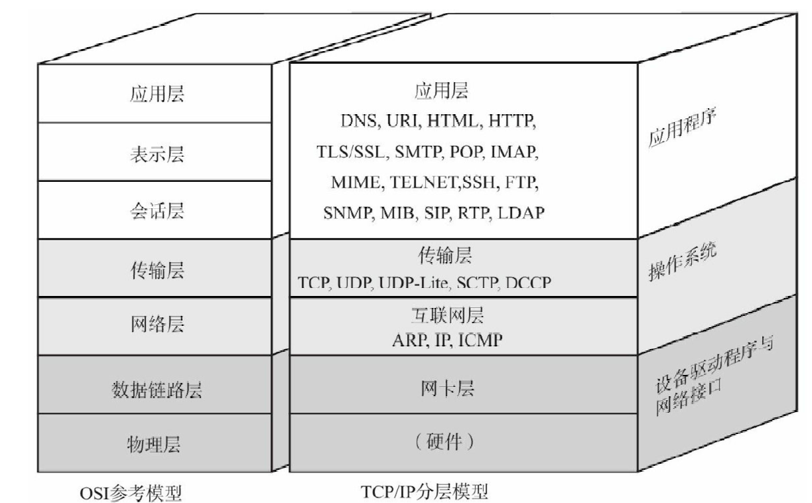
```
-|OSI推荐网络架构
-|--| 应用层：应用相关的处理，比如说使用key/value的结构标明用户数据(username:damon)
-|--| 表示层：数据加密，数据格式的约定(例如文本使用什么编码，音视频数据采用什么封装格式等)
-|--| 回话层：按顺序进行传输，连接管理
-|--| 传输层：收发的确认，专注于如何提高吞吐率，确认数据可达
-|--| 网络层：确保通讯双方能够互相找到对方,寻址和路由选择
-|--| 数据链路层：点对点的传输
-|--| 物理层：比特流能够在物理媒介上进行传输,光或者电信号
```

### HTTP设计原则
1. HTTP不保存状态
-- 更加快速的处理大量事务
-- 确保协议足够简洁，保证其可伸缩性
2. 使用其他方式保证http请求在特定情况的响应速度
-- 管线化(发出一个请求后，不需要等待请求响应就直接发送第二次请求)
-- 长连接

### HTTP的结构
用于HTTP协议交互的信息被称为HTTP报文，其结构通常为

* 请求行：用于请求的方法，请求的URI和HTTP版本号(对什么---URI，做什么---请求的方法)
* 状态行：表明相应结果的状态码(404，500)，原因短语(NOT FOUND, SERVER ERROR)，和HTTP版本
* 首部字段(header)：包含请求和响应的各种条件和属性，一般有四种.header里面所包含的报文信息是HTTP协议里面的大头，大量的信息存放在header中
* 空行：用来分隔header和正文。因为header是可以用户自定义的，所以这里使用一个空行来说明所有的元数据都设置完毕

#### 状态行中的状态码
* 1XX 表示请求正在处理
* 2XX 表示请求成功
* 3XX 表示请求重定向
* 4XX 表示客户端错误
* 5XX 表示服务端错误

#### header
##### header按照其实际用途分为一下四种
1. 通用首部字段
也就是请求和响应都会使用这种header，代表为Cachache-Contro, Data， Via(代理服务器信息)等

2. 请求首部字段/请求头
客户端向服务端发送的请求的时候所使用头部，代表为 Host(请求资源所在服务器)， From(用户电邮), User-Agent等

3. 响应首部字段/响应头
补充了响应附加内容，也会要求客户端附加额外的内容信息，代表为Location(重定向至指定的URI), Proxy-Authenticate， Retry-after等

4. 实体首部字段
针对请求/响应报文的实体部分使用的首部，补充了资源内容更新时间等与实体有关的信息(及元数据).代表有Content-Type，Content-Language， Content-Encoding.

##### 最常用的header之一：cookie
* 为什么需要cookie？
因为http的设计就是无状态的，如果想要保存用户的个人信息，达到免登陆或者是记录上次浏览的地址等效果，则需要有一种方式能够保存当前用户的身份和状态信息，cookie就是解决这个问题的。虽然没有被编入标准化的http/1.1中，但是在实际的web网站中，cookie得到广泛运用

* cookie是怎么工作的
以n天内用户自动登录为例，当用户执行登录操作，提交表单，服务器在响应的头中就会添加上set-cookie，将被当前的状态信息保存下来并用sessionID作为标识。下一次用户发送http请求的时候，比如第二天，用户重新登录，发送的请求头中带有cookie:sessionID这样的字样时，服务端就能识别用户，达到自动登录的效果。(cookie的使用没有标准化，不同的web服务器可能使用可能实现不同。)
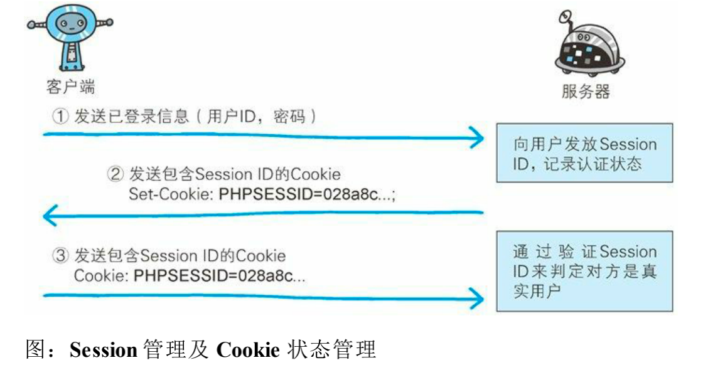

* 其他的用户认证方式还有：Basic认证，Digest认证，SSL客户端认证，但是使用最为广泛的还是上面的这种表单认证。

#### HTTP的编码
1. http可以编码(压缩)提升传输速率(gzip)
2. http的分块传输
-- HTTP分块传输编码允许服务器为动态生成的内容维持HTTP持久连接。通常，持久链接需要服务器在开始发送消息体前发送Content-Length消息头字段，但是对于动态生成的内容来说，在内容创建完之前是不可知的。
-- 分块传输编码允许服务器在最后发送消息头字段。对于那些头字段值在内容被生成之前无法知道的情形非常重要，例如消息的内容要使用散列进行签名
-- 压缩时，分块传输编码可以用来分隔压缩对象的多个部分，虽然压缩是整体压缩，但是其压缩的输出使用文本描述的方案分块传输，这样可以一边压缩一边传输

#### http的其他特性
1. http发送多种类型的数据
使用MIME，比如如果使用的是表单类型，那么就使用(multipart/from-data来表示这部分的数据类型)，使用boundary字符串来划分多部分对象集合，指明各类实体

2. http获取部分内容范围的请求
content-range:bytes 5001-10000/10000 可以用在断点续传。

3. 内容协商
中国的用户和美国的用户同时访问google，那么出来的页面是中文还是英文，也是可以通过http的内容协商来确定

#### 与http协作的各类http服务器
1. 代理：可以是多级的，转发时，需要附加Via字符标记经过的主机信息
用途：可以作为缓存服务器，个人使用正向代理作为翻墙服务器使用。
2. 网关：提高通信的安全性，屏蔽内部服务，可以作为一个集群的统一入口，提供统一的调用方式
3. 隧道：按要求建立一条与服务器的通信线路，届时使用ssl等加密手段通信。

### http协议的问题及缺点
1. 通讯过程中使用明文，所有通讯内容可能被窃听
解法a. 使用ssl建立安全通道后，然后再这条线路上通讯。解法b.对http内容进行加密处理，但这需要通讯双方都知道加密规则
2. 没有验证双方的身份，因此可能遭到伪装
客户端危害：不知道响应的是否为期望服务器
服务端危害：不知道客户端的身份，不知道响应数据是否真的发往了最开始发出请求的客户端，同时没有办法应对大量的恶意请求，如果知道客户端身份的话，可以设置响应频率。
解法a. 使用ssl验明身份。
3. 没有办法验证受到的数据是否是期望数据，可能被篡改，可能被替换
确认数据是否完整和被篡改的方法常为hash值校验，而如使用md5进行校验，则网站上提供的md5结果本身，也可能被篡改。

### 解决http缺陷的答案，https
https = http+加密处理+认证+完整性保护.本质上https就是http+ssl,这里tls和ssl的关系是tls是在ssl的基础上开发的。

#### 加密处理
1. 种类
现在的加密方法中，一般加密算法是公开的，但是加密所使用的秘钥是保密的。根据秘钥的使用方式不同分为对称加密和非对称加密。
2. 对比
对称加密：加密时所使用的秘钥在通讯的双方都是相同的,这样的好处是加密所需要消耗的资源少，加密解密的效率高。但是一旦出现了秘钥泄露的情况，加密的意义也就不存在了，在互联网中不方便直接传输对称秘钥。
非对称加密：使用公私钥对数据进行加密和解密。其中公钥在互联网中传播，私钥只有自己本地存放。

#### https建立链接
服务端提供https服务及https通讯的大致流程如下
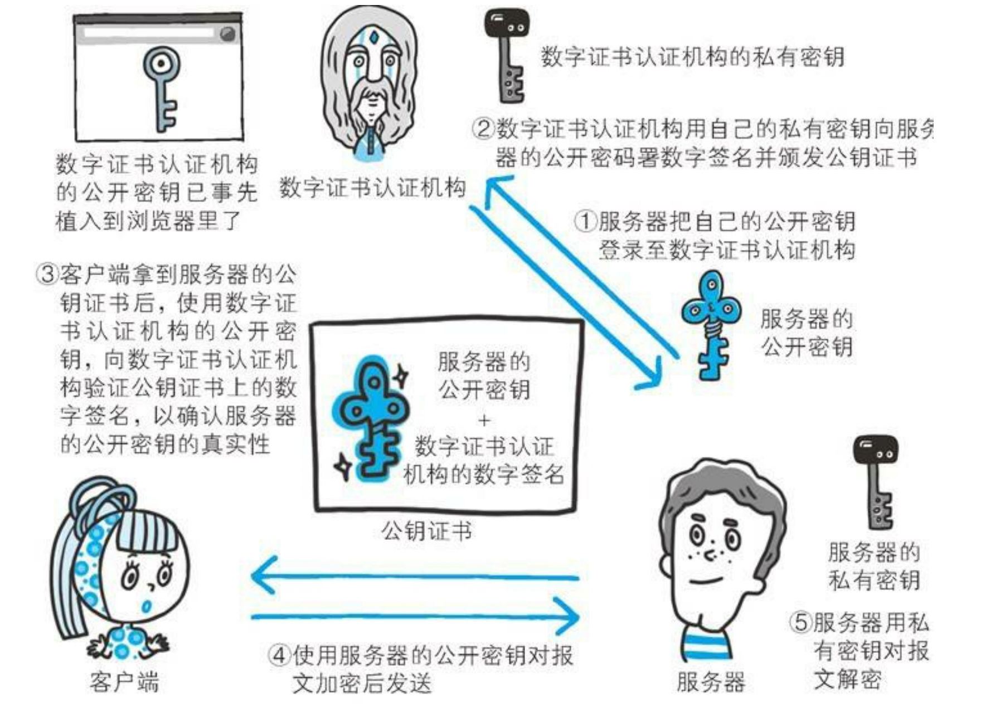

客户端和服务器ssl建立连接的流程图如下所示
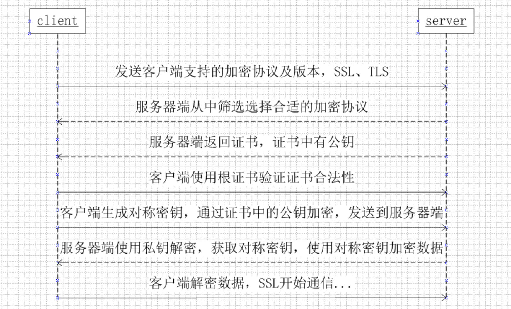

#### 为何不将http全部替换成https
1. https相较于http会慢2-100倍，这个慢体现在两个方面
    - 第一 ssl本身在建连接的时候(也就是握手)也是需要时间的。
    - 第二 ssl在对内容进行加密和解密的时候需要消耗cpu，内存等资源，处理加密解密需要花费一定的时间。

2. ssl所需要的证书本身也需要花钱。

#### 基于http的功能追加协议
当服务端经常会出现大量的更新时，期望客户端能够实时的获取更新后的内容，如果由客户端频繁去请求服务段，则造成大量的无意义请求。

##### Ajax
利用js脚本和DOM，通过更新页面局部内容达到实时加载的效果。因为只需要更新局部内容，所以传输所带来的代价大大降低.但是依旧没有解决大量请求的问题。

##### Comet
用户发送请求确认页面是否更新，comet先将请求挂起，一旦有可用的更新内容立即返回响应。但是为了保留响应，一次连接持续的时间也边长了。

##### SPDY
* 多路复用：使用一个tcp连接就可以处理多个http请求
* 压缩http头部
* 推送功能：可以由服务端主动的向客户端发送数据，这样出现内容更新不需要被动等待
* 赋予请求优先级：
* 服务器提示功能：服务器可以主动提示客户端，请求所需的内容，这样如果客户端有缓存，避免不必要的请求

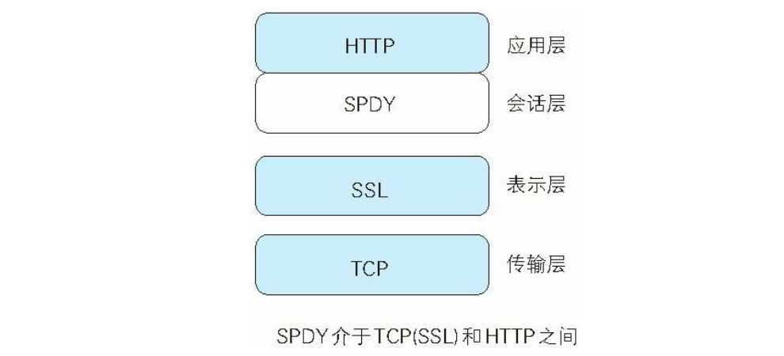

##### http/1.1 队头阻塞问题
* http/1.1当中使用多路复用的情况
1. 用户使用http请求访问获取`script.js`，各个网络传输协议会按下图添加各自内容
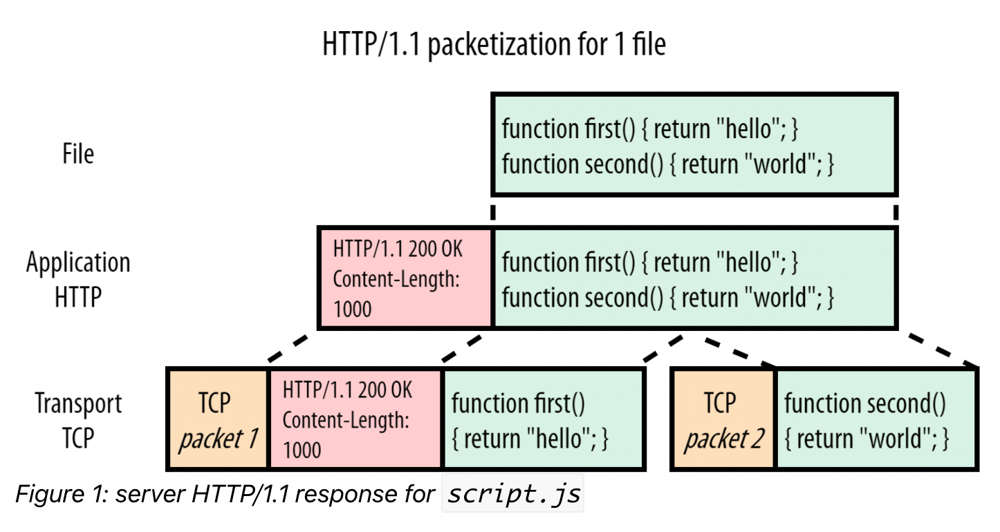
2. 用户此时又访问获取`style.css`网页内容，因为tcp是字节流，所以这里会将`style.css`响应的头放在上一个响应的末尾，响应的实际内容用新的tcp包存放
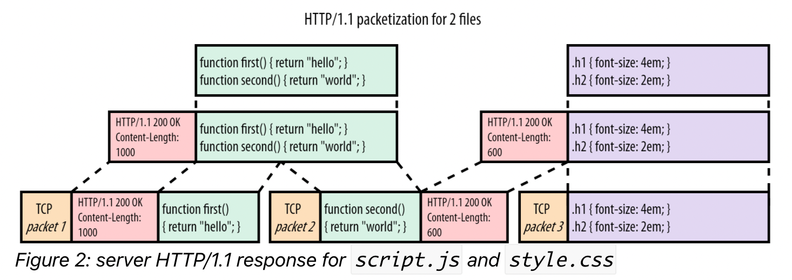

此时问题已经产生，加入`script.js`包很大，而`style.css`包很小，那么在接收到了pakcet3之后如果想要读取`style.css`里面的内容，必须要等到前面一个文件完全接受完毕才行（tcp保序）。即使后面的文件可能很小，但是http/1.1没有方法能够获取这个信息.

##### 使用多路复用结局队头阻塞问题
如果想要解决这个问题，就需要将大文件拆分成小的文件，然后交错的传输小的文件，如果以1表示第一个文件的包，2表示第二个文件的包则一个可能的例子就是原来为
```
11111111122
```
现在改成(实际上多路复用发包的策略也是可以优化的，这里以轮询为例)
```
12121111111
```

##### http/1.1 无法使用多路复用
当使用http1.1交错传输包时，传输js文件的首部部分，然后传输css文件的首部和第一个包，在传输第三个文件的包时，由于这里第三个文件的包里面既包含了js的数据，又包含了css文件的数据（下图三）。当http解析的时候，由于所有的数据都是纯粹的文本，所以当发送第二个包的时候，http会将第二个包中的所有数据视作第一个包也就是js文件中的剩余部分，并且在读到第1000个字节的时候停下来。在读取第三个包的时候，由于他不符合http头的格式，所以http模块也只能将第三个包丢弃，最终js的一个可能的解释结果如下图图四
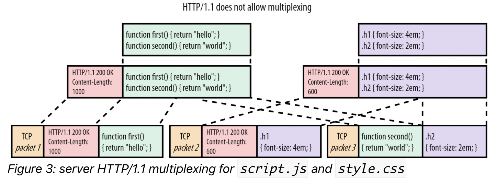
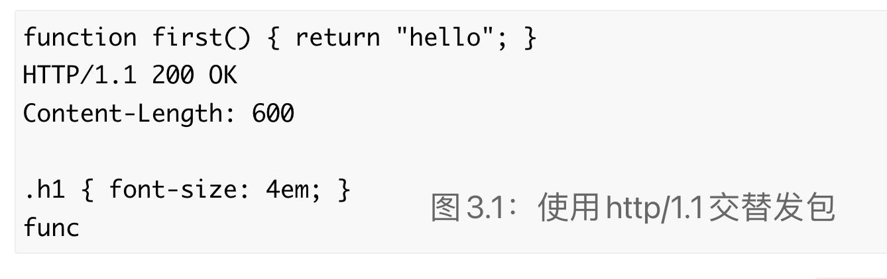

ps:有些场景（访问多个页面）可以使用多个tcp连接来防止多路复用导致的head of line blocking

#### http2.0
http2.前的技术所开发的新的http的规范，大量参考了SPDY里面的内容

##### http2.0里面的多路复用
http1.1之所以没有办法使用多路复用的关键问题在于没有办法区分数据从哪一部分到哪一部分是属于那个http请求的，从图里可以清楚的看到，http2.0加上了一些简单的控制信息(数据帧/data frame)，即`stream id`，同时在数据域前面加上了`content-length`和其`stream id`
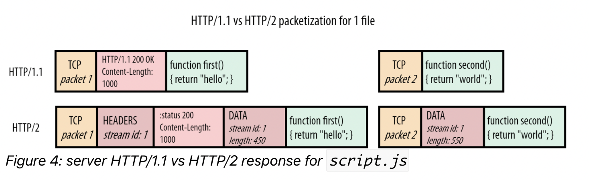

此时http2.0已经能够交互式的拿到数据帧并且不会出现队头阻塞问题，但是还有一个问题是需要注意的，那就是数据的传输顺序对于整体web交互的性能会产生非常的大的影响。
- Fair multiplexing (for example two progressive JPEGs): 12121212
- Weighted multiplexing (2 is twice as important as 1): 221221221
- Reversed sequential scheduling (for example 2 is a key Server Pushed resource): 22221111
- Partial scheduling (stream 1 is aborted and not sent in full): 112222

##### http2.0的多路复用只是解决了应用层的队头阻塞
首先明确一点，tcp并不知道他传输的数据的使用的是什么应用层协议。在下面这个图当中，如果tcp包1和tcp包3到达，但是此时tcp包2尚未到达/丢包待重传，从http的角度来看，实际上此时streamId1的数据已经全部送达，但是从tcp的角度来看，由于tcp包2没有送达，所以tcp包3就会存在于缓冲区，等待tcp包2的到来，然后上传给应用程序。
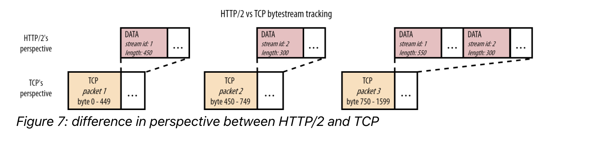

ps:虽然http2.0没有解决tcp层面的队头阻塞问题，但是网络数据丢包的情况是相对少见的，从影响上来看，远不及http队头阻塞造成的影响大。


#### 总结http2.0中的改进
1. 多路复用(multiplexing)：即上文描述的解决队头问题后使用一个连接同时处理多个请求(HTTP/2 does this by splitting data into binary-code messages and numbering these messages so that the client knows which stream each binary message belongs to.)
2. 服务推送(server push)：以抖音或者是直播为例，每秒都有大量的新数据上传，替换传统的客户端请求更改为服务端主动推送会逐渐增大应用场景。
3. 头部压缩(header compression)：http/2使用了HPACK算法进行压缩，减少了重复信息的发送。(This eliminates/消除 a few bytes from every HTTP packet. Given the volume of HTTP packets involved in loading even a single webpage, those bytes add up quickly, resulting in faster loading.)

ps: 这里的多路复用就包含了二进制分帧，实际上多路复用就是需要将数据以而二进制的形式封装到他的需要传输的包里面


#### 参考文章

[Head-of-Line Blocking in QUIC and HTTP/3: The Details](https://calendar.perfplanet.com/2020/head-of-line-blocking-in-quic-and-http-3-the-details/)

[What are the other differences between HTTP/2 and HTTP/1.1 that impact performance?](https://www.cloudflare.com/zh-cn/learning/performance/http2-vs-http1.1/)
