# 图解tcp/ip
## 第一章 网络基础知识
### 计网发展的7个阶段
1. 批处理(将程序和数据放入卡带或者磁带)
2. 分时系统(终端的产生)
3. 计算机通讯(通信线路)
4. 计网产生(窗口系统推动普通大众使用计算器，此时出现路由器，集线器，交换机等设备)
5. 互联网普及
6. 以互联网技术为中心的时代(手机，家电等联网)
7. 无论何时何地，一切皆TCP/IP的网路时代

分组交换:所谓的分组交换本质上就是分包传输然后重组的另一种说法。

### 协议分层与OSI参考模型
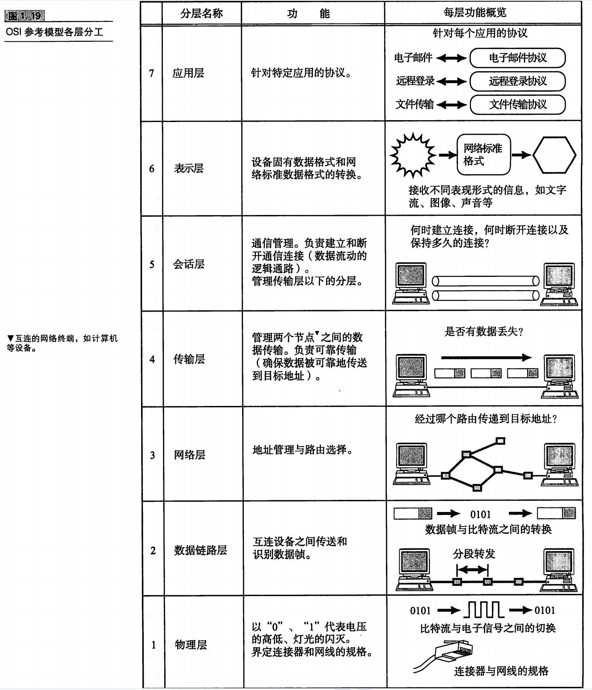

### 网络的构成要素
1. 通信媒介与数据通路：主要是双绞线，光纤线缆，同轴电缆
2. 网卡
3. 中继器：工作在OSI参考模型的第一层，主要是将电缆传过来光/电信号进行波形调整放大再传给另一个电缆
4. 网桥/二层交换机：连接一个网络和另一个网络，桥接就可以通过网桥来实现，工作在OSI中的第二层。他能够识别数据链路层的数据帧，并将数据帧临时存储于内存，然后生成一个全新的帧发送给相连的另一个网段。
5. 路由器/三层交换机：工作在IP层，网桥是根据MAC地址进行处理，路由器是根据ip地址进行处理
6. 4~7层交换机：本质上前端的负载均衡器就是一种4~7层交换机
7. 网关:可以参考portal，负责协议的翻译和转发数据。

## 第二章 TCP/IP基础知识
### TCP/IP的标准化
在TCP/IP的标准化过程中，指定某一个协议的规范本身没有那么重要，首要任务是实现真正能够通讯的技术。在TCP/IP中，只要某个协议大致规范决定下来，人们就会在多个已经实现该协议的设备之间进行通信实验，如果有什么问题，就继续在IEFT中进行讨论，修改程序，协议以及文档

TCP/IP的标准化过程与一般的标准化过程不同，他不是成为标准之后才被投入应用，他在成为标准之间，就已经较为充分的实验过并且较广的普及。

### TCP分层模型与通信示例
#### 发送数据包
以邮件为例，应用程序会将邮件进行编码处理，例如，使用UTF-8对文件进行编码，这些编码相当于OSI中表示层的功能。然后TCP连接，这里连接管理相当于OSI中会话层的功能，随后TCP确保数据可靠传输，IP确保数据能够发送到正确的目标，网卡将数据转换成可以由信道传输的光电信号。至此，发送端所有的任务就都完成了。

## 第三章 数据链路相关技术
### MAC地址
以太网或FDDI中，根究IEEE802.3规范使用MAC地址，其他的诸如无线LAN、蓝牙设备等也是使用想同规格的MAC地址。

#### 共享介质网络
共享介质网络是指多个设备共享一个通信介质的网络，这种网络由于使用的同一个传输介质(例如共享同一个总线)，所以可能会存在冲突问题，这种网络一般有两种介质访问控制方式。
* 争用方式：采用先到先得的方式，如果当前有人发送数据，那么就不发送。如果出现同时发送，则放弃发送数据，等待一个随机时间之后再发送，如果第二次还是冲突则等待时间翻倍，重复十次还是冲突则报错。
* 令牌传递方式：虽然能够完全解决冲突的问题，但是即使当前时刻没有人发送数据，没有拿到令牌的主机也不能发送数据，所以会导致一定程度的信道利用率下降。

#### 非共享介质网络
交换机配合双绞线进行全双工通讯，交换机会根据通讯双方的MAC地址来来对数据进行转发.转发表的更新是根据响应来进行的，如果不在转发表当中就进行广播，谁响应了就将该条数据添加到转发表中。没有办法主动删除，过期自动删除。

### 以太网
* 以太网帧格式：首先是报头，然后是起始帧分隔符，后面跟着MAC头，然后是数据(这里可以是整个IP包)，最后面是帧校验序列。

## 第四章 IP协议
### IP基础知识
数据链路层提供直连的两个设备之间的通信功能，而网络层，则负责在没有直连的两个网络之间进行通信传输。以现实为例，数据链路层更像是火车票，飞机票，网络层则像是行程表。

* 数据链路的抽象化
IP是实现多个数据链路之间通信的协议，不同的数据链路之间最大的区别就是，他们各自的传输最大单位不同（MTU）.(以太网的MTU是1500)

* IP属于面向无连接型
这么做主要有两个原因，一个是为了简化，管理连接本身是一个非常繁琐的事情。另一个是为了提速，每次通讯之前先建立连接会降低处理速度。当需要连接时，可以委托上一层协议提供此项服务。

### IP地址
* IP地址由网络号和主机号两部分标识
起初网络号和主机号是以分类进行区分，但是到了现在基本是以子网掩码来区分。

* IP的广播和多播
广播地址用于在同一个链路中相互连接的主机间发送数据包，将IP地址中的主机地址全部设置为1，就成了广播地址。IP多播相当于是广播的一个优化，避免了直接广播给整个通讯线路带来的影响。

### 子网掩码
由于IP地址刚开始分配的时候，使用的地址分类导致大量的IP地址被浪费，子网掩码这种新的标识网络号和主机号的方式应运而生。引入了子网后，一个IP地址就有了两种识别码，一个是IP地址本身，另一个就是标识网络号的子网掩码。
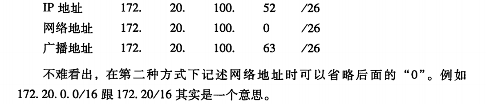

由于ABC类地址的浪费，人们开始放弃了IP地址的分类，采用任意长度分割IP地址的网络标识和主机标识。先后使用CDIR(固定25位子网掩码)和VLSM(可变长度子网掩码)，现在使用的基本都是VLSM，即 x.x.x.x/y的形式。后面的0可以省略

* 私有地址分为几块，没有什么原因，就是单纯的当时还剩下了这些地址没有分配
1. 10.0.0.0 ~ 10.255.255.255
2. 172.16.0.0 ~ 172.31.255.255
3. 192.168.0.0 ~ 192.168.255.255

### 路由控制
需要记住三个特殊的路由情况：
1. 默认路由：一般为0.0.0.0
2. 主机路由：子网掩码为32，意思是整个IP都参与路由
3. 环回路由：同一台计算机的程序之间的路由，通常为127.0.0.1

此外路由表可以通过路由聚合来减少路由表示的行数，如果有多个匹配则匹配子网掩码最长的，如果没有匹配则使用默认路由，如果一样则选择跳数最短的进行路由。

### IP分割处理与再构成处理
* IP报文的分片和重组
任何一台主机都有必要对IP分片进行相应的处理。一种可能是通过路由器进行分片，另一种可能是主机自己进行分片。**经过分片之后的IP数据包在被重组的时候，只能由目标主机完成**。这样的处理结果是多方原因构成的，首先是现实中没法保证IP数据是否经由同一个路径发送，另外拆分后的每个分片也可能会在途中丢失，如果途径下一个路由器，还有被继续分片的可能。

* 路径MTU发现
由于路由器的的处理负荷日益加重，其要做的事情越来越多(网络过滤等)，如果可以，应尽量避免路由器进行分片，另外，在分片处理中，如果一个分片丢失，则整个数据全部作废。为了应对这个问题，路径MTU发现应运而生。
具体实现是：在IP头部将禁止分片标志位设置为1，如果路由器需要分片则使用ICMP小心通知MTU，下一次发送使用这个MTU分割数据，如此往复，直到接收不到ICMP消息则证明整条通路上的所有的路由器都没有进行分片
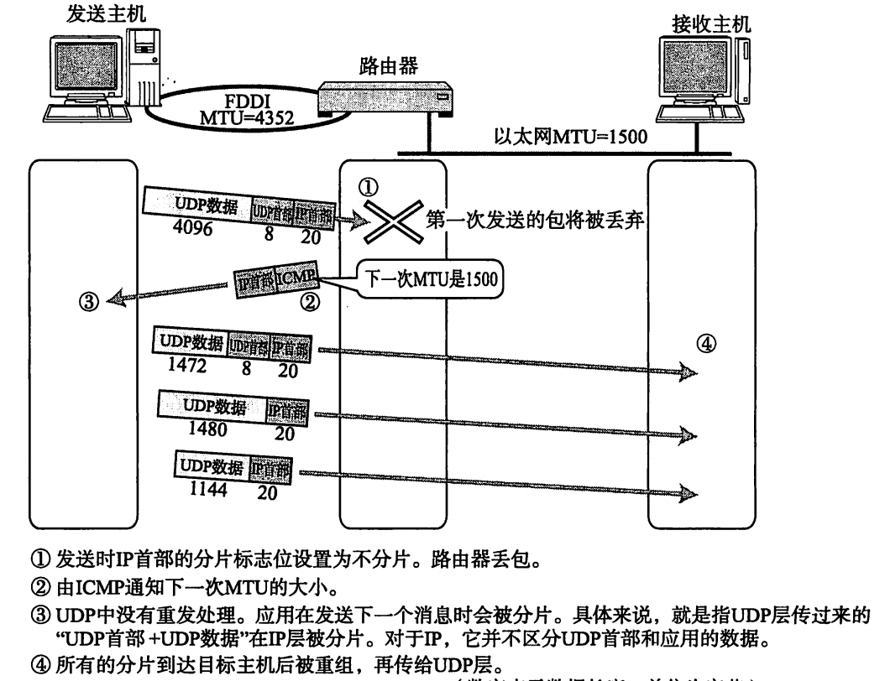

### IPv4首部
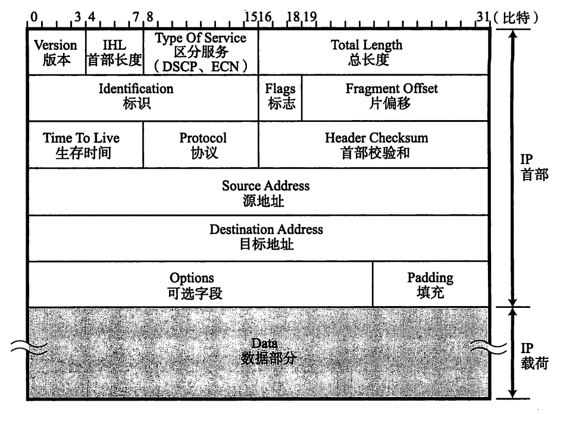
* 区分服务，包含优先度等标识，但是目前几乎所有网络都无视这些字段。
* 标识：每个分片的标识想同（不同的ip即使标识想同也不是同一个包的不同分片）
* 片偏移：标识辈分片的每一个分段相对原始数据的位置
* 协议：上层的协议编号
* 可选项：长度可变，通常只有实验和诊断的时候用，包含：安全级别，源路径，路径记录，时间戳

### IP相关技术
* DNS: DNS相关的根域，查询流程，域名的构成概念要记住。
* DHCP：自动IP设置，统一管理IP地址分配
* NAT：解决地址不够用的问题，但是外部无法主动访问内部的电脑，也相当于更加安全
* IP隧道：连接IPv4和IPv6一个方法就是给IPv4加装一个IPv6的头，让他能够穿过IPv6的路由器，最后将头拆掉即可。
* IP任播：以访问DNS根域名服务器为例，发请求时到根域名服务器时，一个合适的IP也将被发送出去。
* 显示拥塞通知：将拥塞通知的标志位加入到IP头当中，但是通知具体能否被收到也是一个问题，因为可能和IP对接的是一个不支持拥塞控制的协议。

### 第六章 TCP与UDP
#### UDP特点及目的
UDP是一个纯粹的传输协议，在收到应用程度发送过来数据的那一刻，立即原样发送到网络上。没有重传，流量控制，拥塞控制等手段。
#### TCP
##### 序号和ACK号确认可靠传输
使用序列号与确认号确保请求的可靠，如果确认号，ACK号的值是下一个要收到的字节号。如果迟迟没有收到ACK号，则判定为超时需要重传数据。

##### 超时时间避免丢包
超时时间最好是能够比确认应答时间高一点点。超时时间的确认参考两个因素：1. 往返时间 2. 偏差，连续超时一定次数就会判断网络或者主机端发生了异常，强制关闭连接。
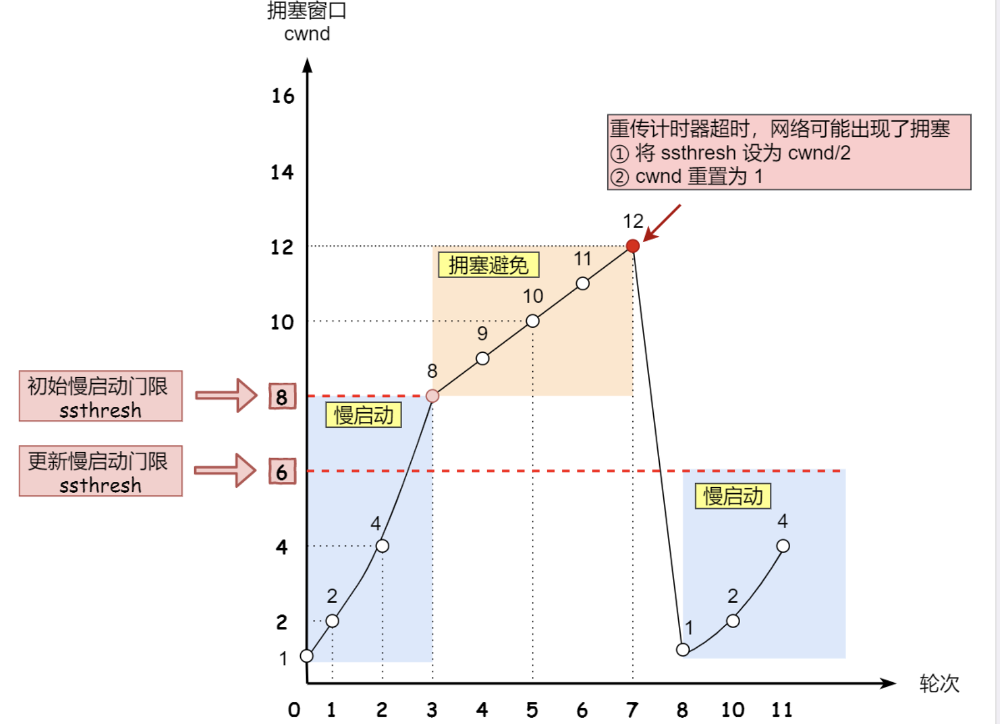

##### 连接管理
TCP以段为单位发送数据，在发送大数据时，数据会被分割成MSS进行发送，在进行三次握手的时候，MSS就会被就计算得出。在建立连接请求的时候，MSS会被放入TCP首部，通讯双方会选择一个较小的值投入使用。 
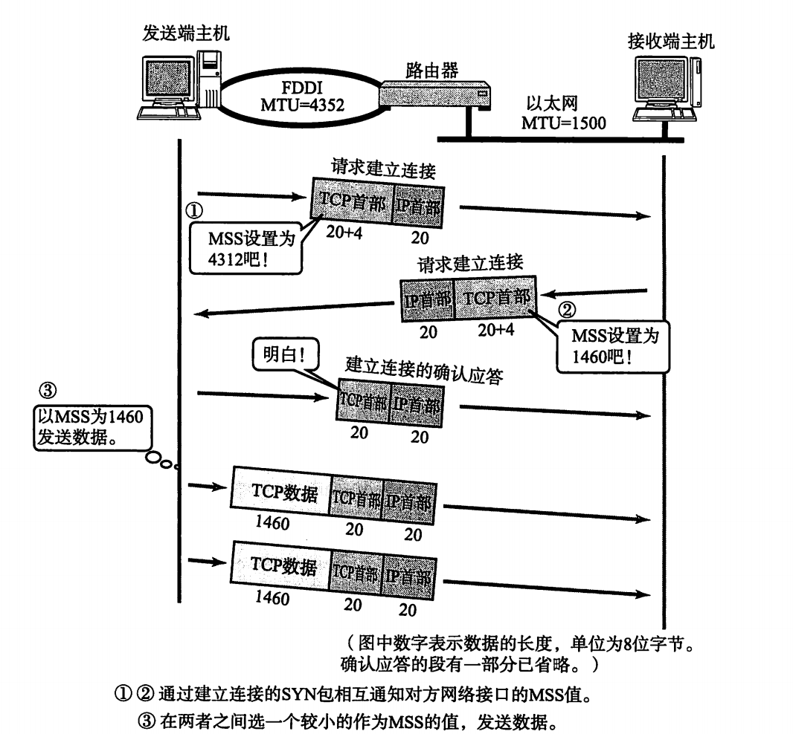

##### 滑动窗口的窗口控制
所谓窗口控制就是当需要多个响应的时候，稍微等一会儿，假如此时又其他的数据包接受成功，则合并成同一个响应返回(即是响应后面那个，就表明前面的那个已经响应成功，这里也可以将窗口更新的响应放入到同一个响应包当中)

##### 重发控制
如果发送端主机连续三次收到同一个ACK，就会将其对应的数据进行重发，这是因为当使用滑动窗口的时候，如果接收端收到了1001，1003，1004，1005四个包，此时在接收到1003，1004，1005的包的时候响应依旧是1002，标明下一个包的起始位置是1002，当连续三次收到同一个包的ack之后，就会不等待超时，触发快重传，主动重传1002

##### 流控制
所谓的流控制就是发送端会根据接收端的能力进行数据发送，因为假如发送端发送的数据已经超过了接收端的缓冲区大小，那么发送多余的数据不仅不会被处理，还会造成网络拥塞。在tcp头中，专门有一个字段用来通知窗口大小，接收端可以将缓冲区大小放入这个字段通知发送放。
发送端在受到缓冲区占满的消息之后，会暂停发送，如果后续缓冲区更新的消息没有收到，可能会造成无法通信(客户端认为已经发送了ACK，但是接受端迟迟收不到，接收端可能会认为缓冲区还没准备好。)，所以发送端会时不时发送窗口探测包(一字节)确认缓冲区信息。
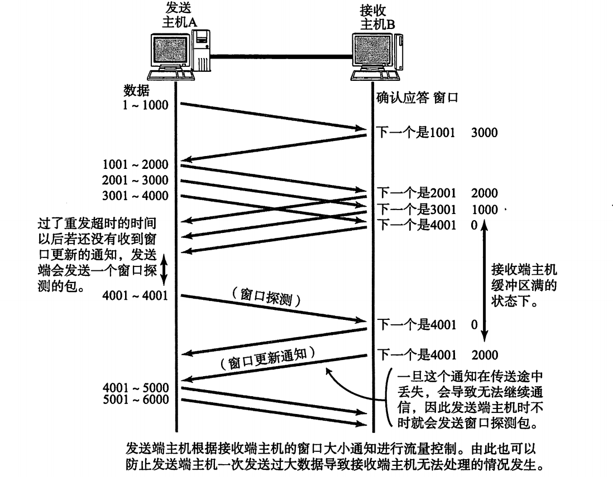

#### 拥塞控制
首先，为了在发送端调节所要发送数据的量，定义了一个叫“拥塞窗口”的概念。此外在慢开始和避免算法切换中有一个门限值，也即是因为窗口大小不同而切换算法的阈值
##### 慢开始
拥塞窗口的值是由1开始，然后以二为指数进行增长，也就是加倍，加倍的时机为每次收到ACK的时候。然后将拥塞窗口和接收端主机发送过来的窗口进行比较，选取区中较小的一个作为实际的窗口，然后发送窗口里面的数据。

##### 拥塞避免
拥塞避免算法让拥塞窗口缓慢增长，即每经过一个往返时间RTT就把发送方的拥塞窗口cwnd加1，而不是加倍。这样拥塞窗口按线性规律缓慢增长。

无论是在慢开始阶段还是在拥塞避免阶段，只要发送方判断网络出现拥塞（其根据就是没有按时收到确认，虽然没有收到确认可能是其他原因的分组丢失，但是因为无法判定，所以都当做拥塞来处理），就把慢开始门限ssthresh设置为出现拥塞时的发送窗口大小的一半（但不能小于2）。然后把拥塞窗口cwnd重新设置为1，执行慢开始算法。**这样做的目的就是要迅速减少主机发送到网络中的分组数，使得发生拥塞的路由器有足够时间把队列中积压的分组处理完毕**。

##### 快重传
快重传要求接收方在收到一个**失序的报文段**后就立即发出重复确认（为的是使发送方及早知道有报文段没有到达对方，可提高网络吞吐量约20%）而不要等到自己发送数据时捎带确认。快重传算法规定，发送方只要一连收到三个重复确认就应当立即重传对方尚未收到的报文段，而不必继续等待设置的重传计时器时间到期。如下图：

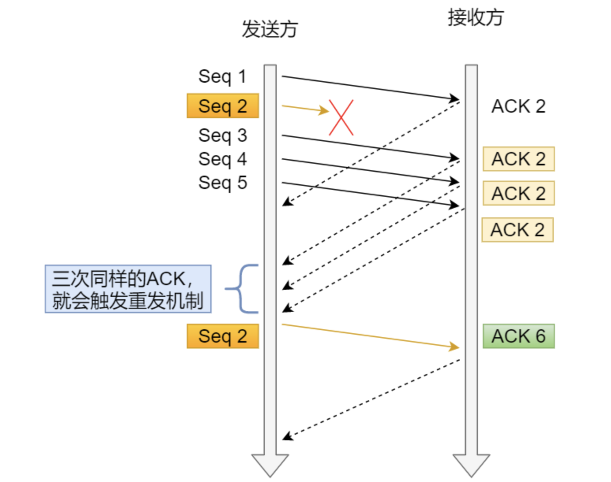

##### 快恢复
快恢复是和快重传配合使用的算法，当发送方连续收到**三个重复ACK**时，就执行“乘法减小”算法，，把ssthresh设置为cwnd的一半，把cwnd设置为ssthresh的值加3，然后重传丢失的报文段，加3的原因是因为收到3个重复的ACK，表明有3个“老”的数据包离开了网络。
下面左边是超时导致的慢启动时窗口大小的折线图，右边是使用快恢复算法的窗口大小折线图（现在常用的TCP Reno版本）

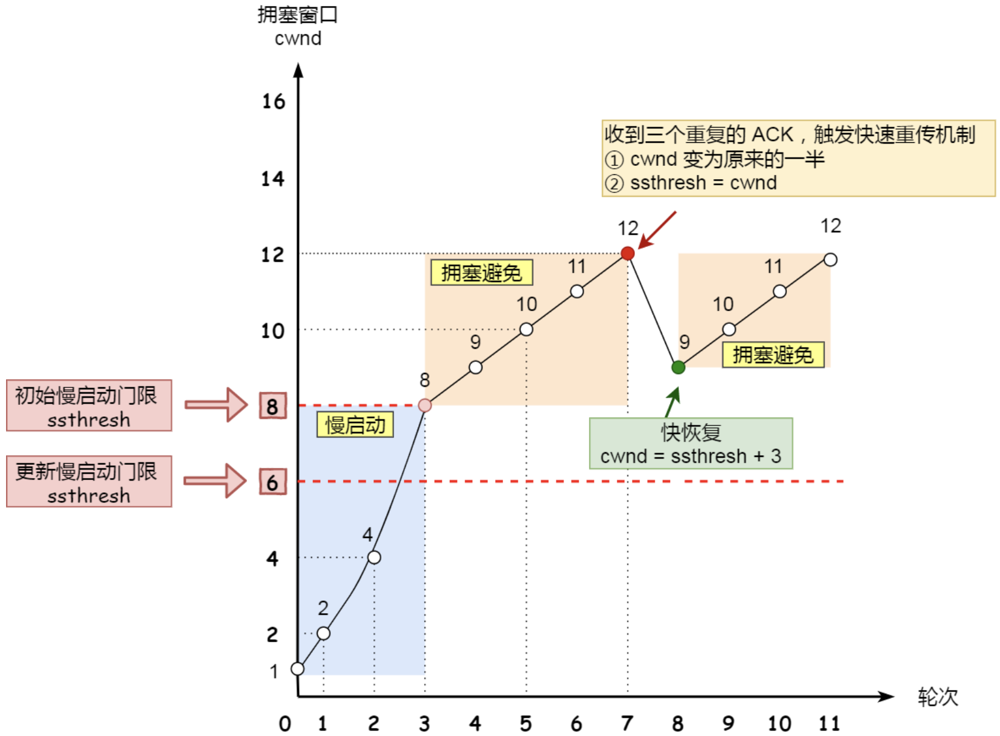

##### 提高网络利用率的规范
* Nagle算法：发送端即使还有要发送的数据，但如果这段数据很小的话，就进行延迟发送
* 延迟应答算法：如果每个请求刚接收到就应答太占用网络资源了，如果响应合并到一起然后再发送则能大大提高网络利用率，同样的还有可以吧窗口大小的更新和ACK放到同一个TCP应答包里面以提高网络利用率(实际使用中，TCP传输文件，通常都是两个数据段返回一个确认应答)
* 捎带应答：应用层协议中，有的时候发送过去的消息需要一个回执，此时可以将应用层的回执也放到TCP应答包里面以减少收发数量。

#### UDP 首部格式
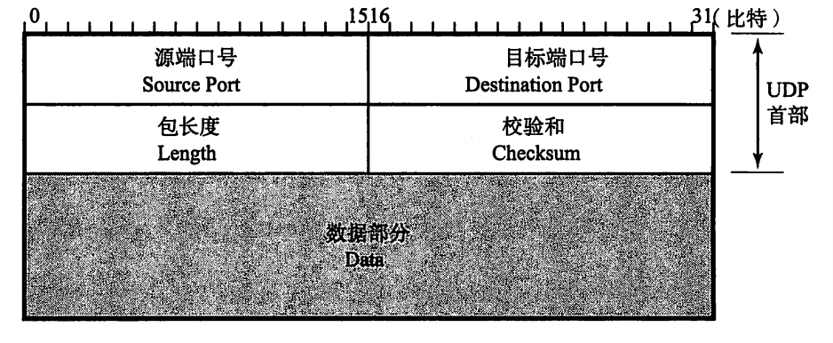

#### TCP 首部格式
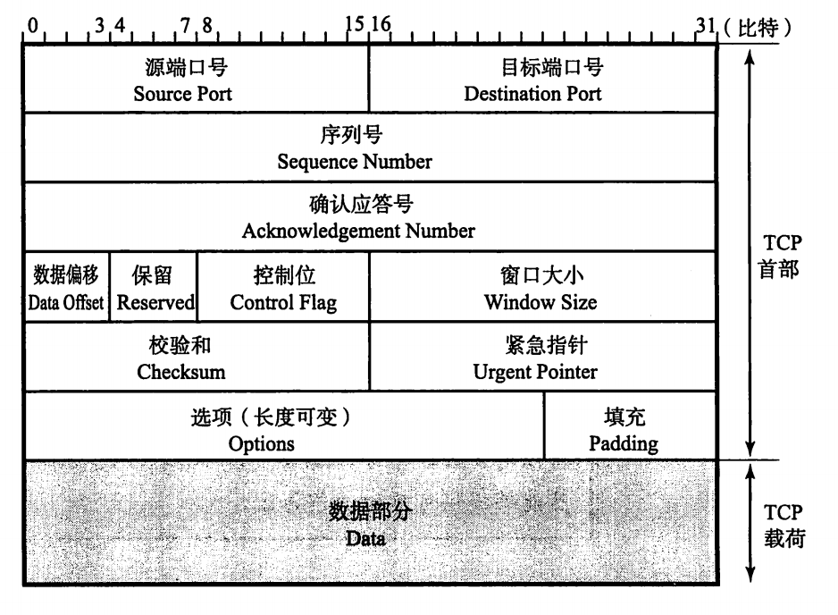
* 紧急指针：一般不使用，如果使用，如何处理紧急数据属于应用问题，一般在暂时断开通讯，或者中断通讯时使用。
* 选项：用户提高TCP传输性能，有很多个类型，各自的值代表各自的意思。

## 第八章 应用协议
### www
www定义了三个重要的概念
* 访问信息的手段：URI
* 信息的表现形式：HTML
* 信息的转发：http
关于应用协议详情查看图解http相关笔记

#### 参考文献
[TCP流量控制、拥塞控制](https://zhuanlan.zhihu.com/p/37379780)
[30张图解： TCP 重传、滑动窗口、流量控制、拥塞控制](https://www.cnblogs.com/xiaolincoding/p/12732052.html)
[快重传和快恢复](https://baike.baidu.com/item/%E5%BF%AB%E9%87%8D%E4%BC%A0%E5%92%8C%E5%BF%AB%E6%81%A2%E5%A4%8D/5825161)
