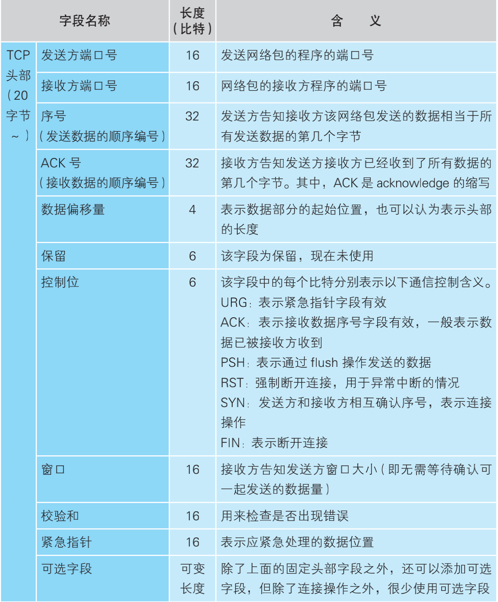

## 网络是怎样连接的

### 第一章 web浏览器
输入了网址按下回车之后，浏览器就会解析url，首先是协议类型，常见的比如http，file，ftp等。下面以http://www.lab.glasscom.com/dir 为例解析

DNS解析：输入地址生成请求之后，首先要做的就是知道该域名实际存在的ip号，此时会用到DNS解析器。
DNS客户端实际上已经内置到了操作系统的socket库，使用upd发送请求(请求非常小，一个包就足够)，关于DNS服务器的地址通常是内置在操作系统的配置文件中，可更改。

域名的层次结构：在域名中，越靠右的域名代表器层级越高，默认存在根域，没有名字，域名通过.来进行层次结构的划分，每个域都是当成一个整体来进行处理。DNS服务器中还存在他子域服务器的IP。

首先查询最近的DNS服务器查看是否知道该域名指向的ip是多少，如果不知道则向根域发送查询请求，然后依次找寻结果。(现实中两个域的DNS服务器可能由同一台服务器处理)

### 第二章 用电信号传输tcp/ip数据
##### 套接字
套接字是通信对象的ip地址，端口号，通信状态等信息的集合，它本身就是这类信息的抽象。

##### 连接
在创建tcp套接字之后，使用tcp套接字发送实际数据之前，首先还需要进行连接工作。对于tcp来说，连接实际上是通讯双方交换控制信息，这里的控制信息可以是序列号初始值，缓冲区大小协商等。在连接的过程当中，通讯的双方交互的是双方的控制信息，此时还没有实际的数据交互.

##### 控制信息
控制信息分为两类，一类是存放在tcp包头部的控制信息如下图，另一类储存在tcp套接字中，用来控制协议栈操作的信息。应用程序传递来的信息以及从通讯对象接收到的信息还有收发数据的执行状态都会保存在套接字当中，协议栈会根据这些信息来执行每一步操作。不同的套接字实现可能不同，比如windows和linux协议栈实现方式可能不同，但是相互通讯使用的接口相通即可。

##### TCP头部格式

##### 连接操作的实际过程
1.客户端创建一个包含表示开始数据收发操作的控制信息头部。通过接收/发送方的ip&port确认对象，将头部控制位中的SYN比特设置为1
2.服务器找到对应的对应的套接字后会将其状态更改为正在连接，同时将SYN控制位设置为1（如果不接受连接则将RST控制位设置为1），此外，将ACK控制位设置为1表示已经接收到了对应的网络包。
3.客户通过tcp头部信息确认连接服务器是否成功，如果SYN控制位为1，则表示连接成功，此时向套接字中写入服务器的ip端口等信息，然后将状态改为连接完毕。然后发送一个ACK为1的响应。

##### 将http请求消息发送给协议栈
协议栈不关心发送过来的数据是什么内容，只是单纯的完成他的工作——发送。并且，发送数据不是一接收到应用程序的数据就直接发送而且想将数据放到数据缓冲区当中。何时发送数据参考因素有二：
1.数据长度优先：每个网络包能容纳的数据长度有限，一旦超过或者接近发送数据长度，则立即发送数据 
2.时间优先，如果一定时间内没有更新，为了保证数据交互的时效性，也需要将网络包发出。
两个判断因素是互相矛盾的，如果长度优先则传输效率提高，能够使用更少的传输包传输更多的数据(传输效率更高)，如果是时间优先则数据的实时性更好。

##### 大体量数据数据的发送
对于一个tcp包装不下的数据，发送缓冲区的数据会被以MSS(max segment size,除去tcp包头的最大数据大小)长度进行拆分，拆分出来的每块数据会被放进单独的网络包中。

##### 使用ack号确认网络包已收到
tcp模块在拆分数据时，先要计算每块数据相当于从头开始的第几个字节,并将结果存储在tcp头部的ack号字段(这和控制位ack不同)。发送数据的长度可以通过将整个tcp包的长度减去tcp头部的长度来计算出来，所以不用放在tcp头部。
举例来说，如果上一次接收到第1460字节，那么如果接下来收到的包序号为1461，那么说明中间没有遗漏，如果序号为2921则说明中间有包遗漏。像这样，如果确认没有遗漏，接收方会将目前为止接收到的数据长度加起来，计算一共接受了多少字节，然后将这个数值写入tcp头部的ack号发送给发送方。实际在数据传输的过程当中，数据不会从1开始，那样数据的发送太容易预测了，实际包序号的初始值会在连接的时候就商量好了,客户端在发送连接请求的时候，除了将SYN置为一，还会同时设置序号字段的值。(这里客户端和服务端双方的初始序号值都不同)
通过上面这个机制，可以确认接收方是否收到了某个数据，如果对方没有接收到则重新发送，也是因为这个机制足够强大，网卡、集线器、路由器都没有错误补偿机制，一旦检测到错误就直接丢弃相应的包。

##### 根据网络包平均往返时间调整ACK号等待时间
所谓的ACK号等待时间实际上就是超时时间，当网络传输繁忙时就会发生拥塞，ACK 号的返回会变慢，这时我们就 必须将等待时间设置得稍微长一点，否则可能会发生已经重传了包之后， 前面的 ACK 号才姗姗来迟的情况。这不仅仅是多发了一个包而已那么简单，实际上多数超时都是网络拥塞引起的，如果此时还有多余的包传输则会让原本拥堵的网络雪上加霜。
TCP 采用了动态调整等待时间的方法，这个等待时间是 根据 ACK 号返回所需的时间来判断的,如果ACK号返回时间变快则缩短超时时间如果变慢则拉长超时时间。

##### tcp的滑动窗口
如果在等待ACK的过程中什么都不做，那么也太浪费时间了，为了减少这样的浪费，tcp使用滑动窗口的方式来管理数据的发送和ACK号的操作。发送端在发送时也会根据接收端发送的ACK来对接收端的缓冲区进行判断，如果发送的包已经达到了接收端的缓冲上限且没有收到ACK则停止发送。

##### ACK和窗口的合并
要提高收发数据的效率，还需要考虑另一个问题，那就是返回 ACK 号和更新窗口的时机。
更新窗口大小的时机应该是接收方从缓冲区中取出数据传递给应用程序的时候。发送ACK的时机是当接收方收到数据时，如果确认内容没有问题，就应该向发送方返回ACK号。如果分别发送则太浪费资源了，因此，接收方在发送 ACK 号和窗口更新时，并不会马上把包发送出去，而是会等待一段时间，在这个过程中很有可能会出现其他的通知操作，这样就可以把两种通知合并在一个包里面发送了

##### ACK号合并和窗口大小响应的合并
举个例子，在等待发送ACK号的时候正好需要更新窗口，这时就可以把 ACK 号和窗口更新放在 一个包里发送，从而减少包的数量。当需要连续发送多个ACK号时，也可以减少包的数量，这是因为 ACK 号表示的是已收到的数据量，也就是 说，它是告诉发送方目前已接收的数据的最后位置在哪里，因此当需要连 续发送 ACK 号时，只要发送最后一个 ACK 号就可以了，中间的可以全部省略。

##### 接收http响应消息
首先，协议栈会检查收到的数据块和 TCP 头部的内容，判断是否有数据丢失，如果没有问题则返回 ACK 号。然后，协议栈将数据块暂存到接收缓冲区中，并将数据块按顺序连接起来还原出原始的数据，最后将数据交给应用程序。具体来说，协议栈会将接收到的数据复制到应用程序指定的内存地址中，然后将控制流程交回应用程序。 将数据交给应用程序之后，协议栈还需要找到合适的时机向发送方发送窗口更新B。

##### 从服务器断开并删除套接字
当一方需要断开连接时，数据发送完成后会发送连接关闭请求，将控制位FIN置为1，另一端数据发送结束后也会发送FIN确认数据已经发送完毕。

* TIME_WAIT状态的作用:首先明确，断开请求发起端会出于TIME_WAIT
1.四次挥手中，A 发 FIN， B 响应 ACK，B 再发 FIN，A 响应 ACK 实现连接的关闭。而如果 A 响应的 ACK 包丢失，B 会以为 A没有收到自己的关闭请求，然后会重试向 A 再发 FIN 包。
2.如果由于网络的延迟，导致了FIN包的重传，而旧的socket此时如果直接删除，可能导致新的套接字刚创建就收到了FIN包而关闭连接。
3.通常这个等待时间一般是几分钟，没有规定的

##### IP
IP地址是由上层的模块委托的，IP模块补充上对应的IP头部。当存在多个网卡的时候通过接收方的ip判断使用哪一个网卡，和路由器一样，如果没有对应网络号的网卡则使用默认网卡。
生成了 IP 头部（表 2.2）之后，接下来 **IP 模块还需要在 IP 头部的前面加上MAC 头部**（表 2.3）。

* ARP：ARP就是用用广播对所有设备提问：“×× 这个 IP 地址是谁的？请把你的 MAC地址告诉我。”然后就会有人回答：“这个 IP 地址是我的，我的 MAC 地址是××××。”，为了加快访问速度，ARP命中之后也会放入缓存。

* 以太网原型：这种以太网因为使用的是主干网线，采用广播的方式，所以可能出现冲突，如果冲突，则大家都沉默一个随机时间，然后再发送数据，如果还是冲突则再沉默（时间逐渐拉长），重复十次则报错。

* 网卡: 网卡会给TCP模块传下来的包再加上三个控制数据，报头，起始帧分界符，以及在末尾机上用于检测错误的帧校验序列。

* 时钟信号和数据信号：在测量电压和电流时必须先判断出每个比特的界限在哪里，不然一连串的高电流无法判断其中有几个1，最简单的方法是再发送一条时钟信号，但是问题在于传输路程长的时候时钟信号和数据信号传输会产生时间差，且这种做法十分浪费资源。解决方法是使用抑或的方法，将时钟信号和数据信号进行叠加(如图2.26),将叠加之后的额数据进行传输，然后通过图2.24所示的额外传输的报头和起始帧分界符来辅助分割两种信号，还原数据。

* 向集线器发送网络包：在半双工模式中，为了避免信号碰撞，首先要判断网线中是否存在其他设备发送的信号。如果有，则需要等待该信号传输完毕，因为如果在有信号时再发送一组信号，两组信号就会发生碰撞。当之前的信号传输完毕，或者本来就没有信号在传输的情况下，我们就可以开始发送信号了。当网络拥塞时，发生碰撞的可能性就会提高，重试发送的时候可能又会和另外一台设备的发送操作冲突，这时会将等待时间延长一倍，然后再次重试。以此类推，每次发生碰撞就将等待时间延长一倍，最多重试 10次，如果还是不行就报告通信错误。

##### UDP
* 何时使用UDP：
1.控制用的短数据-->一个包就能够覆盖所有的数据,此时就不需要重传之类的操作，应用程序如果没有接收到响应再发一次请求就好了
2.音视频数据-->强调实时性，偶尔的丢包只是造成卡顿，不会导致更加严重的问题。

* UDP头部信息

##### 数据收发操作小结

### 第三章 从网线到网络设备
##### 信号在网线和集线器中传输
* 每个包都是独立传输的，上一个传输的成功与否和下一个包没有关联
* 防止网线中的信号衰减很重要，一般来讲，网线越长，信号损失越严重，如果本身失真的数据进一步衰减可能导致0和1的误判
* 双绞线是为了抑制噪声。首先日常电器产生磁场通过右手螺旋定责产生的电流通过双绞进行抵消(正负极交替)，双绞线本身流过的电流通过各个接口的间距控制从而相互抵消。在一根网线中，每一对信号线的扭绞间隔（节距）都有一定的差异，这使得在某些地方正信号线距离近，另一些地方则是负信号线距离近。由于正负信号线产生的噪声影响是相反的，所以两者就会相互抵消
* 当信号到达集线器后，会被广播到整个网络中。以太网的基本架构就是将包发到所有的设备，然后由设备根据接收方 MAC 地址来判断应该接 收哪些包，而集线器就是这一架构的忠实体现，它就是负责按照以太网的 基本架构将信号广播出去。

##### 交换机的包转发操作
* 网桥就是一种交换机，这里所说的交换机专指服务于OSI第二层的交换机(有的书中可能认为路由器也是一种交换机)
* 交换机的基本结构，交换机的端口不核对接收方 MAC 地址，而是直接接收所有的包并存放到缓冲区中，然后通过MAC地址表核对需要将数据发送到机器中的哪个端口.MAC 地址表主要包含两个信息，一个是设备的 MAC 地址，另一个是该设备连接在交换机的哪个端口上

* MAC地址表的更新：如果请求有MAC号码和端口号，则直接转发并在MAC地址表中添加上该条转发的记录，MAC地址表没办法主动删除某条记录，而是过段时间记录会自动删除，如果你把自己的笔记本从房间拿走，那么只有过段时间才会自动将这条记录删除。如果MAC记录表上没有记录，那么就广播数据，后续谁响应了这条请求就将对应的MAC地址和端口对应上，添加至MAC地址表。(目标地址和源地址想同则直接丢弃)
* 全双工模式可以同时进行发送和接收：双绞线中，由于发送和接收是独立的，所以不会发生碰撞，只要不使用集线器，就不会发生碰撞。

##### 路由器的包转发操作
* 路由器的基本知识:路由器和交换机核心区别在于路由器是基于IP设计的，交换机是基于以太网设计的。通过更换网卡，计算机不仅可以支持以太网，也可以支持无线局域网， 路由器也是一样。由于路由器是基于IP设计的，而IP可能会和多种类型的网络传输协议配套使用，所以可能路由器的网卡很多，能够支持的协议也很多。

* 首先会通过端口将发过来的包接收进来，这一步的工作过程取决于端口对应的通信技术转发模块会根据接收到的包的IP头部中记录的接收方IP 地址，在路由表中进行查询，以此判断转发目标。然后，转发模块将包转移到转发目标对应的端口，端口再按照硬件的规则将包发送出去

* 路由器以太网数据包转发例子：刚才我们讲到端口模 块会根据相应通信技术的规范来执行包收发的操作，这意味着**端口模块是 以实际的发送方或者接收方的身份来收发网络包的。以以太网端口为例，路由器的端口具有 MAC 地址，因此它就能够成为以太网的发送方和接收方（不会成为IP的发送和接收方）**。端口还具有IP地址，从这个意义上来说，它和计算机的网卡是一样的。当转发包时，首先路由器端口会接收发给自己的以太网包，然后查询转发目标，再由相应的端口作为发送方将以太网包发送出去。

* 路由表中的信息:路由器根据“IP 地址”判断转发目标,路由器会忽略主机号，只匹配网络号。网关和接口两列，它们表示网络包的转发目标。根据目标地址和子网掩码匹配到某条记录后，路由器就会将网络包交给接口列中指定的网络接口（即端口）B，并转发到网关列中指定的 IP 地址。(使用端口B，发送目的地为指定IP地址)

* 子网掩码：其中子网掩码会帮助路由器确认路由路线，在这个例子中，无论发往任何一个子网，都是通过路由器 A 来 进行转发，因此我们可以在路由表中将这3个子网合并成 10.10.0.0/16，这样也可以正确地进行转发，但我们减少了路由表中的记录数量，这就是路由聚合。

* 路由表的更新：主要分为两种1. 人工维护 2.根据路由协议机制,通过路由器之间的信息交换由路由器自行维护路由表的记录

* 路由表的接收操作和网卡的接受操作没有实质上的区别

* 路由表的发送：判断转发目标的第一步，就是根据包的接收方IP地址查询路由表中的目标地址栏，以找到相匹配的记录。就像前面讲过的一样，这个匹配并不是匹配全部 32 个比特，而是根据子网掩码列中的值判断网络号的比特数，并匹配相应数量的比特。如果出现多条结果则发送给网络号更长的那个，如果多条结果都相同，那么就使用跃迁数小的发送，如果一个都没匹配到，那么就使用默认路由进行发送(路由表中子网掩码为 0.0.0.0 的记录表示“默认路由”。)

* 包的有效期：TTL这是为了防止进入一个地方陷入死循环，一般设置为64/128，如果经历了这么多个路由器之后还没有发送到目的地，那么就会失效。

* IP包分片：由于IP层不仅仅服务于以太网，不同协议的MTU可能不同，如果包的大小超过了端口能够发送的大小(路由器的端口),IP就需要将上层的数据进行分片(这里可以是一个完整的TCP包).查询字段，如果不能分片则丢弃，使用ICMP消息通知对方.

* 路由器判断下一个转发目标的方法如下：如果路由表的网关列内容为 IP 地址，则该地址就是下一个转发目标。如果网关列内容为空，则IP头部中的接收方IP就是下一个转发目标。(路由器也使用ARP查询下一个转发目标的MAC地址)

* 路由器和交换机之间的关系：要理解两者之间的关系，关键点在于计算机在发送网络包时，或者是路由器在转发网络包时，都需要在前面加上 MAC 头部。之前的讲解都是 说在开头加上 MAC 头部，如果看图 3.16 大家可以发现，准确的说法应该是将 IP 包装进以太网包的数据部分中。

* 当然，这里讲的内容只适用于原本实现 IP 和以太网机制的纯粹的路由器和交换机，实际的路由器有内置交换机功能的，比如用于连接互联网的家用路由器就属于这一种，对于这种路由器，上面内容可能就不适用了。

##### IP协议的设计原则
IP协议并不规定数据实际是如何传输的，实际的传输会委派更加底层的传输协议，比如无线网/以太网等等。IP协议所解决的问题是如何确保通讯的双方的唯一性、通讯双方的通讯路线是怎么样的、包的拆分等等，具体的传输的方式，IP协议没有规定，这样的设计原则是的IP协议能够对接大量的不同的底层协议，使得各种底层协议都能够和IP协议进行对接

##### 路由器的附加功能
* 地址转换(NAT),如果这里不加上端口号，那么有多少台电脑需要连接外网，就需要多少个外网ip，加上端口号的映射关系之后则可以避免这个问题。

* 包过滤：对包进行转发时，根据 MAC 头部、IP 头部、TCP 头部的内容 A，按照事先设置好的规则决定是转发这个包，还是丢弃这个包。我们通常说的防火墙设备或软件，大多数都是利用这一机制来防止非法入侵的。同时这里可以发现，防火墙除了可以是软件之外，还可以是硬件。

### 第四章 通过接入网进入互联网内部
更多的是运营商之间或者是主干网之间的信息如何交互，个中协议暂不浪费时间。

### 第五章 服务器端的局域网中有什么玄机
##### 防火墙的结构和原理
* 主流的是包过滤方式,即只允许发往特定服务器中的特定应用程序的包通过，然后屏蔽其他的包。网络包的头部包含了用于控制通信操作的控制信息，只要检查这些信息，就可以获得很多有用的内容。

* 通过端口号限定应用程序：当我们要限定某个应用程序时，可以在判断条件中加上 TCP 头部或者 UDP 头部中的端口号

* 通过控制位判断连接方向：TCP在连接过程需要收发三个包，其中第一个包的TCP控制位中SYN为1，ACK为0，其他包中这两个值都不同，因此只要按照这个规则就能够过滤到TCP连接中的第一个包，从而实现可以从内访问外，而不能从外访问内的效果。下图中，第一行和第三行确保了所有从外部请求都能到达服务器，第二行确保服务器不会发送请求到外网(防止一些病毒之类的让服务器发送请求,帮助计算)。

##### 负载均衡
* 使用DNS进行负载均衡:对于同一个域名，如果绑定多个ip，则在进行域名解析的时候将会以轮询的方式返回ip(所有ip都返回，但是前后顺序不同)

* 使用负载均衡器:使用负载均衡器的ip代替具体服务的ip注册到dns，然后通过负载均衡器作为中间代理实现对后端服务的请求，因为是代理服务器，所以可以有很多定制的功能，包括负载均衡策略的选择(加权，轮询，最小负载...)

* 使用缓存服务器降低负担：可以有客户端缓存服务器和服务端缓存服务器(反向代理)

* CDN(内容分发网络)：本质上就是缓存服务器，然后将缓存服务器部署在离用户近的地方，通过使用自己的线路避开拥塞点，从而提高传输效率，另一方面，由于用户访问CDN的时候，都是就近访问，缩短了客户端到服务端的距离，提高了访问效率。

* CDN路由选择
1.使用DNS进行路由.首先，作为准备，需要事先从缓存服务器部署地点的路由器收集路由信息。例如，在图 5.13 的例子中，一共有 4 台缓存服务器，在这 4 台服务器的部署地点又分别有 4 台路由器，则我们需要分别获取这 4 台路由器的路由表，并将 4 张路由表集中到 DNS 服务器上。接下来，DNS 服务器根据路由表查询从本机到 DNS 查询消息的发送方，也就是客户端 DNS 服务器的路由信息。例如，根据图 5.13 路由器 A 的路由表，可以查出路由器 A 到客户端 DNS 服务器的路由。依次查询所有路由器的路由表之后，我们就可以通过比较找出哪一台路由器距离客户端 DNS 服务器最近。

(还有其他方式，比如重定向等)

#### 第六章 请求到达 Web 服务器，响应返回浏览器
##### 服务器概览
这里值得注意的是服务端套接字在listening的阶段，一旦客户端的包到达，就会返回响应包并开始接受连接操作。接下来，协议栈会给等待连接的套接字复制一个副本，然后将连接对象等控制信息写入新的套接字中（图 6.3）。刚才我们介绍了调用 accept 时的工作过程，到这里，我们就创建了一个新的套接字，并和客户端套接字连接在一起了。复制出一个新的套接字之后，原来那个处于等待连接状态的套接字会怎么样呢？它还会以等待连接的状态继续存在，当再次调用 accept，客户端连接包到达时，它又可以再次执行接受连接操作。

##### 服务器网卡模块接收操作
1. 接收操作的第一步是网卡接收到信号，然后将其还原成数字信息 。局域网中传输的网络包信号是由 1 和 0 组成的数字信息与用来同步的时钟信号叠加而成的，因此只要从中分离出时钟信号，然后根据时钟信号进行同步，就可以读取并还原出 1 和 0 的数字信息了。

2. 接下来需要根据包末尾的帧校验序列（FCS）来校验错误，即根据校验公式计算刚刚接收到的数字信息，然后与包末尾的 FCS 值进行比较。到这里，接收信号并还原成数字信息的操作就完成了，还原后的数字信息被保存在网卡内部的缓冲区中。

3. 在这个过程中，服务器的 CPU 并不是一直在监控网络包的到达，而是在执行其他的任务，因此 CPU 并不知道此时网络包已经到达了。但接下来的接收操作需要 CPU 来参与，因此网卡需要通过中断将网络包到达的事件通知给 CPU。

##### 服务端IP模块的接收操作
1. IP 模块会首先开始工作，检查 IP 头部。IP模块首先会检查 IP 头部的格式是否符合规范，然后检查接收方 IP 地址，看包是不是发给自己的。

2. 确认包是发给自己的之后，接下来需要检查包有没有被分片。检查 IP头部的内容就可以知道是否分片，如果是分片的包，则将包暂时存放在内存中，等所有分片全部到达之后将分片组装起来还原成原始包

3. 检查 IP 头部的协议号字段，并将包转交给相应的模块。例如，如果协议号为 06（十六进制），则将包转交给 TCP 模块；如果是 11（十六进制），则转交给 UDP 模块。

##### TCP如何处理连接包
1. 当 TCP 头部中的控制位 SYN 为 1 时，表示这是一个发起连接的包。这时，TCP 模块会执行接受连接的操作，不过在此之前，需要先检查包的接收方端口号，并确认在该端口上有没有与接收方端口号相同且正在处于等待连接状态的套接字。如果指定端口号没有等待连接的套接字，则向客户端返回错误通知的包 。

2. 如果存在等待连接的套接字，则为这个套接字复制一个新的副本，并将发送方 IP 地址、端口号、序号初始值、窗口大小等必要的参数写入这个套接字中，同时分配用于发送缓冲区和接收缓冲区的内存空间。然后生成代表接收确认的 ACK 号，用于从服务器向客户端发送数据的序号初始值，表示接收缓冲区剩余容量的窗口大小，并用这些信息生成 TCP 头部，委托IP 模块发送给客户端。
3. 这个包到达客户端之后，客户端会返回表示接收确认的 ACK 号，当这个 ACK 号返回服务器后，连接操作就完成了。
4. 这时，服务器端的程序应该进入调用 accept 的暂停状态，当将新套接字的描述符转交给服务器程序之后，服务器程序就会恢复运行

##### TCP如何处理数据包
1. 首先，TCP 模块会检查收到的包对应哪一个套接字。在服务器端，可能有多个已连接的套接字对应同一个端口号，因此仅根据接收方端口号无法找到特定的套接字。这时我们需要根据** IP 头部中的发送方 IP 地址和接收方 IP 地址**，以及 TCP 头部中的接收方端口号和发送方端口号共 4 种信息，找到上述 4 种信息全部匹配的套接字。

2. 找到 4 种信息全部匹配的套接字之后，TCP 模块会对比该套接字中保存的数据收发状态和收到的包的 TCP 头部中的信息是否匹配，以确定数据收发操作是否正常。具体来说，就是根据套接字中保存的上一个序号和数据长度计算下一个序号，并检查与收到的包的 TCP 头部中的序号是否一致。如果两者一致，就说明包正常到达了服务器，没有丢失。这时，TCP模块会从包中提出数据，并存放到接收缓冲区中，与上次收到的数据块连接起来(每次接收完毕都会进行)。这样一来，数据就被还原成分包之前的状态了 

3. 当收到的数据进入接收缓冲区后，TCP 模块就会生成确认应答的 TCP 头部，并根据接收包的序号和数据长度计算出 ACK 号，然后委托 IP 模块发送给客户端.

##### TCP使用IP中的IP信息
在互联网的分层当中，传输层理论上来说是没有权限能够访问网络层中的内容的，也就是说，TCP在进行数据处理的时候，是没有权限去访问IP层从的IP信息的，如果要访问，那么应该是通过一个附加信息传递下来。但是从实际的角度出发，TCP和IP之间的交互非常的频繁，如果每次都需要从IP层传下来附加信息来通知TCP其IP地址，必然会增加通讯成本，降低整体的数据传输效率。所以通常这样的规定都是没有定死的，某些场景下打破常规以换来更加高效的处理速度。

##### 名词解释
1. url和uri：url是浏览器上面输入的东西，uri是唯一资源标识符，标识着这个资源在网络上的唯一标识。通常url是包含了uri的,但不绝对。
2. www和http：www是一套基于客户端/服务器方式的信息发现技术和超文本技术的综合,http则是应用层的传输协议。在url中WWW is a prefix used to indicate that a website is using HTTP to communicate. In fact, you can mix and match prefixes, for example http://example.com or www.example.com.

#### 参考文献
[HTTP & WWW: Website URLs Explained](https://wpengine.com/resources/http-vs-www-urls-for-seo/)
* 向集线器发送网络包
