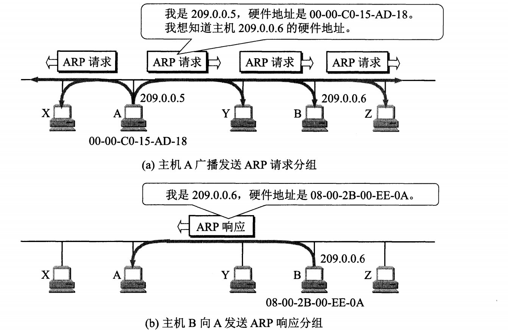
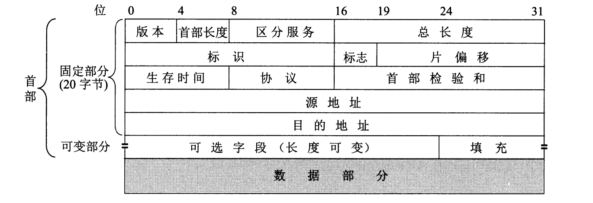
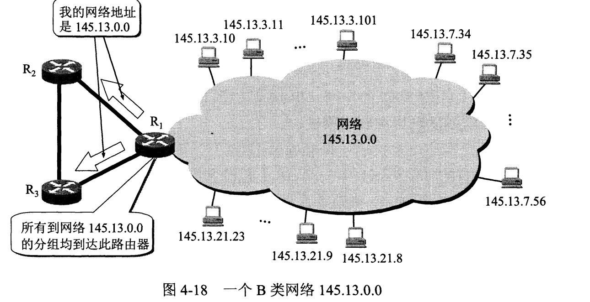
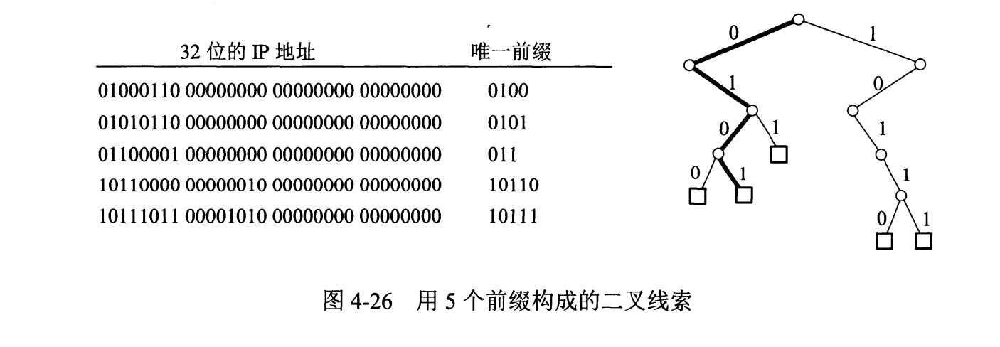
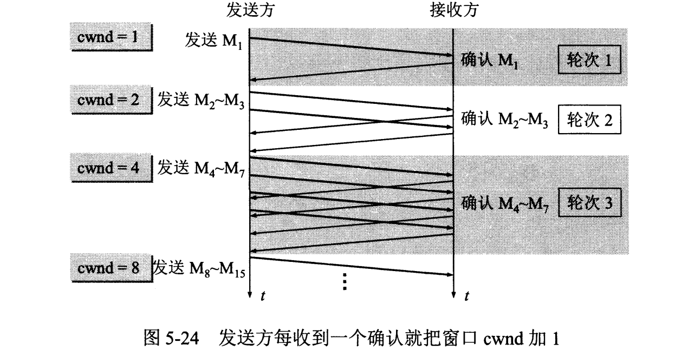
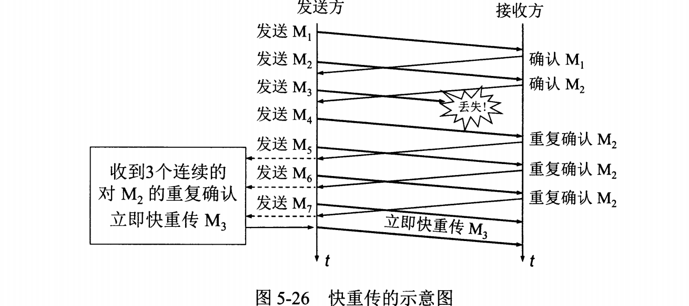
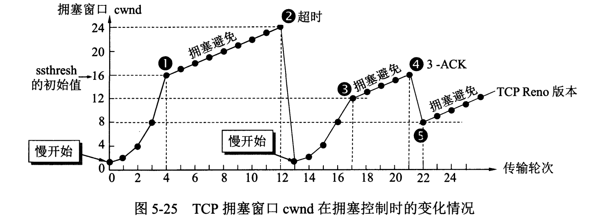
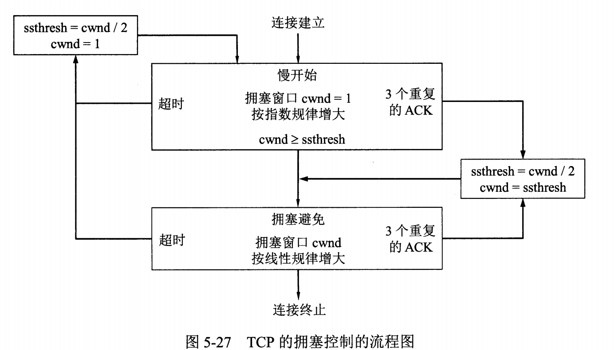
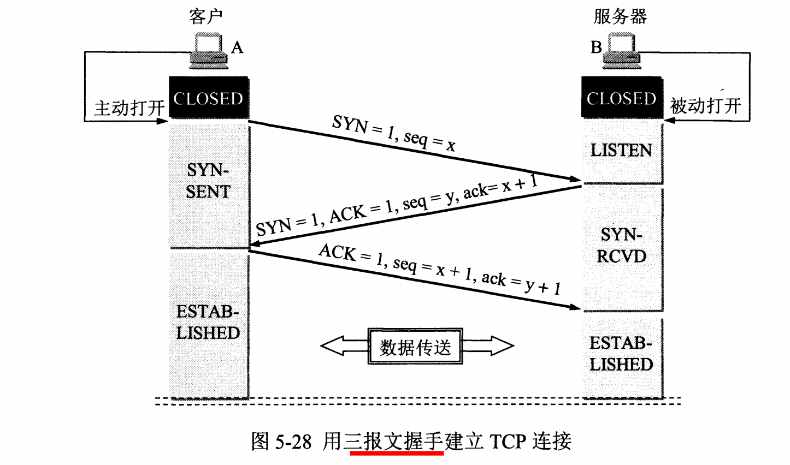
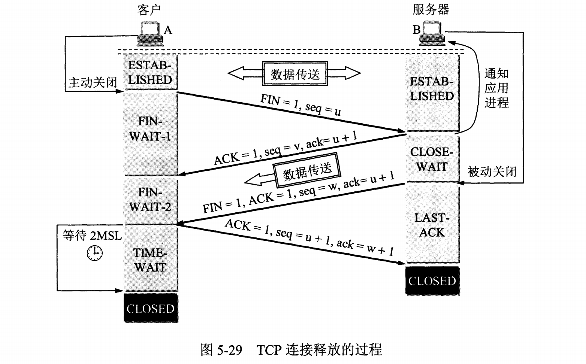

# 计算机网络
## 第四章 网络层
### 核心内容
* 虚拟互联网络的概念
* IP地址和物理地址之间的关系
* 传统的分类地址的IP(包括子网掩码)和无分类域间选择路由CIDR
* 路由选择协议的工作原理

### 网络层提供服务
**网络层向上值提供简单灵活的、无连接的、尽最大努力交互的数据报服务**。
由于网络层提供服务质量的承诺，这使得路由器等设备可以相对简单，由于协议本身的简单，使其能够更加简单的应用在更多场景，对接更多的协议。

#### 网际协议
和IP协议配套使用的还有三个协议，APR，ICMP，IGMP

#### 虚拟互连网络
首先明确一点，没有任何一个单一的网络能够适应所有用户的需求，互联网的本质就是将各种各样的网络连接到一起，使之能够相互通讯交换信息。将网络互相连接起来的中间设备根据其所在的层次结构大致有以下四种中间设备。
1. 物理层中使用的中间设备叫做转发器(中继器，主要是增强信号)
2. 数据链路层所使用的转发设备叫网桥/桥接器(通过MAC地址进行转发)
3. 网络层所使用的中间设备叫路由器(通过IP地址进行转发)
4. 网络层以上的转发设备叫网关。(envoy，slb之类的负载均衡器都可以看做是网关)

各种性能形态各异的网络全部都通过IP协议连接在一起，在网络层上来看，他们就好像是一个统一的网络。这种统一是一种虚拟的统一，实际上网络的构成可能是NAT，可能是wifi，可能是网线直连等等等等。

#### IP地址及其表示方法
1. 分类的IP地址
2. 子网的划分
3. 构成超网

#### IP地址特点
* IP地址分为网络号和主机号，优点如下
1.分配IP的权利下放，IP运营机构只分配到网络号这一层，具体那台主机使用哪个IP由申请了网络号的用户决定，更加灵活
2.提高寻址效率，不同的网络间通过网络号识别身份，网络内部通过主机号识别身份。
* IP地址是标识一台主机或者一条链路的接口，当一台主机想要连接到两个网络时，需要同时具备两个网络号不同的IP地址。
* 一个网络，是指有相同网络号的主机的集合，因此使用中继器或者转发器/网桥连接起来的若干个局域网依旧算是同一个网络

#### IP地址和硬件地址
从层次来看，物理地址是数据链路层和物理层使用的地址，以MAC地址为例，其在网卡进行初始化时设置为全球唯一的MAC地址，存入网卡的ROM，可以修改MAC地址，只要**当前网络**当中没有重复即可正常使用。
IP地址是网络层和以上层次各层使用的地址，是一种逻辑地址（说它是一种逻辑地址是因为IP地址是使用软件实现的）

#### IP地址需要强调的点
1. IP层抽象的互联网上只能看到IP数据报，MAC头在经过网卡时就被拆开确认了
2. 虽然IP数据报首部有源站IP地址，但是路由器仅根据目的站的IP地址的网络号进行路由选择
3. 在局域网数据链路层，只能看见MAC帧
4. 尽管相互连接在一起的网络的硬件体系各不相同，但是IP层抽象的互联网屏蔽了下层很复杂的细节，只要我们在网络层讨论问题，就能够使用统一的、抽象的IP地址研究主机和主机或路由器之间的通信.

#### 地址解析协议ARP
**IP地址和和下面的网络的硬件地址之间由于格式不同而不存在简单的映射关系**，ARP就是根据IP地址获取MAC地址的协议。每台主机都设有一个ARP高速缓存，里面有**本局域网**上各主机和路由器的IP地址到硬件地址的映射表

简述ARP的工作方式就是通过IP的网络好找到对应的局域网，然后再局域网里面进行广播，问一句这个IP地址是谁的，对应IP地址的主机发送应答并提交自己的MAC地址


ARP为每一条记录都设置了缓存时间，超过缓存时间就会自动删除，如果之前就已经在映射表里面，那么直接发送即可。

### IP 头部数据报格式


* 区分服务：用来获得更好的服务，实际上一直没有使用过
* 标志：是用来区分上层协议使用的是哪一个
* 标识和片偏移使用来在IP进行分片的时候确认当前IP包所在哪一个分片的哪一个位置。

##### 分类IP分组转发算法步骤
依次进行以下判断
1. 从数据报首部提取目的主机的IP地址D，得出网络地址N
2. 若N就是与此路由器直接相连的某个网络地址，则**直接交付**
3. 若路由表中的有目的IP地址为D的特定主机路由，则交给表中的下一个路由
4. 如果路由表中有到达网络地址N的路由，则交给表中的下一个路由
5. 路由表中有默认路由使用默认路由
6. 分组转发报错

### 划分子网和构造超网
#### 原网络的问题
原有的IP地址空间利用率有时很低。
1. 空间利用率非常低：A类地址由于主机号太长会导致大量的浪费，C类主机号太少，很多公司虽然C类够用但是还是申请B类。
2. 给每一个物理网络分配一个网络号会**使路由表变得太大**而导致网络性能变坏。
3. 两级IP地址不够灵活：加入一个A类地址申请者想要开通一个新的网络，必须要重新申请

#### 划分子网
凡是从外部网络发送给本单位某台主机的IP数据报，仍然是根据IP数据报的目的网络号找到连接在本单位网络上的路由器。对外来说寻址不变，但是对内将一部分的主机号转换成了网络号。


#### 子网掩码帮助路由器进行路由
子网掩码通常是一串全11111...0000的数字，使用子网掩码的好处是，不管有没进行子网的划分，与原IP与子网掩码进行与运算最终其网络号都是一样的，路由器在处理到来的分组数据时可以使用想通的算法。

##### 子网分组的转发
只是修改了网络地址N的计算，也就是网络地址现在需要根据当前的IP和子网掩进行与运算得出

### 无分类编址CIDR有如下特性
* 使用子网掩码的前面一部分也就是IP的前缀作为网络号
* 消除了传统的各类地址以及划分子网的概念。
* 使用斜线计法。
* 之所以称之为构成超网是他所包含的地址数一定是2的n次幂
* 可以使用路由聚合来缩短路由表的大小
* 最长匹配

##### 使用二叉线索查找路由表
为了简化二叉线索的结构，可以先找出对应于每个IP地址的唯一前缀。下图中每个叶子节点就代表了一个IP地址。
假设现在有一个IP地址是`10011011 01111010 00000000 00000000`，从最左边开始查起，很容一发现，查到第三个字符时，在二叉线索中就找不到匹配的，说明这个地址不在这个二叉线索中

## 第五章 运输层
### 关键概念
1. 运输层为相互通信的应用进程提供逻辑通信
2. 端口和套接字的意义
3. 无连接的UDP的特点
4. 面向连接的TCP的特点
5. 在不可靠网络上实现可靠传输的原理，停止等待协议和ARQ(Automatic Repeat reRequest)协议
6. TCP的滑动窗口、流量控制、拥塞控制和连接管理

### 传输层协议概述
网络层为主机之间提供逻辑通信，传输层为应用进程之间提供端对端的逻辑通信(这里的端对端指的是主机的端口)
传输层还要对收到的报文进行差错检测，在网络层，IP报头中的校验和字段只是检测首部是否出现差错，而不检测数据部分是否出现数据损坏。

#### UDP概述
1. UDP无连接，尽最大努力交付
2. UDP是面向报文的，应用程序给多少数据，他就装多少数据(不超过最大长度)，如果报文太长，IP就会将这个报文进行分包，但这会降低IP层的效率
3. UDP没有拥塞控制
4. UDP支持一对一，一对多，多对一，多对多的交互通信
5. UDP首部开销小

#### UDP首部格式


如果接收方发现收到的报文中的目的端口号不正确（即不存在对应该端口的进程），就丢弃该报文，并通过ICMP发送端口不可达的差错报文给发送方。

在进行校验和计算时，需要用到伪首部，所谓伪首部，就是指计算校验和的时候临时加上的，不是UDP实际发送过来的首部。

### TPC
#### 可靠传输的工作原理
##### 停止等待协议(ARQ)
在发送端A向接收端B发送数据的时候，这里需要注意以下三点
1. A在发送完一个包M1之后，必须暂时保留已发送包的副本
2. 发送包和确认包都必须进行编号
3. 超时计时器设置的重传时间应当比数据在分组传输的平均时往返时间更一点

接收端收到这个包之后需要做两个事情
1. 如果重复就丢弃这个包M1，不用向上层交付(不用吐出来给到应用层)
2. 向发送端A发送确认
这里说明一下向发送端A发送确认，如果之前的ACK只是慢了，那么A会将重复的ACK丢弃

这样，通过自动重传请求，我们就可以实现在不可靠的网络上进行可靠传输。

##### 连续ARQ协议
处于发送窗口内的所有数据包都可以发送，而不需要等待对方的响应，这样信道的利用率就提高了。接收方一般采用累积确认的方式，对按序到达的最后一个包发送确认。

##### 以字节为单位的滑动窗口
* 接收端只能对**按序号收到的数据中最高序号**给出确认。
* 缓存空间和序号空间都是有限的并循环使用的(实际的缓存或者窗口的字节数相当大)
* 同一时刻，A的发送窗口和B的接收窗口可能是不一样大的，一方面是B的响应数据需要时间，另一方面A发送窗口还会根据当是的拥塞情况调节。
* TCP中接收方对于没有按序受到的数据没有明文规定，但是为了提高网络的利用率，一般都是将其存放在缓存窗口
* TCP中要求接收方必须有累计确认的功能，但推迟时间不能超过0.5秒

##### 超时重传时间的选择
超时重传的概念很简单，但是时间节点的选择是TCP最复杂的问题之一。TCP使用了一种自适应算，其参考的主要是指标是RTT以及RTT之间的差值。通过给RTT加权以及参考最近的RTT差值从而获得较为准确的超时重传时间。

现在有一个问题，在计算RTT的时候，如何判断当前ACK包是重传包的ACK还是上一个包的ACK，如果不能确认这个ACK是哪个包的ACK会对RTT的判断产生较大的影响。结论是由于ACK包中没有区分此次ACK是首个包还是重传包的ACK(也没办法知道)，所以在进行计算的时候，所有发生过重传的包的RTT都不会加入计算。

##### 选择确认SACK
在确认收到的包没有问题之后且仅是顺序不同，能否只重传没有收到的包，通知发送放已经收到了哪些包(包的大小不一致，如第一个包是500字节第二个包是1000字节)？
答案是可以，但是这需要使用TCP首部选项中的SACK字段，者必须双方都事先商定好。

#### TCP流量控制
* 概念
所谓的流量控制，就是让发送方的发送速率不要太快，要让接收方来得及接收。简单说就是发送放的窗口不能超过接收方的接收窗口。

* 接收方每次收到数据包，可以在发送确定报文的时候，同时告诉发送方自己的缓存区还剩余多少是空闲的，我们也把缓存区的剩余大小称之为接收窗口大小，用变量win来表示接收窗口的大小。发送方收到之后，便会调整自己的发送速率，也就是调整自己发送窗口的大小，当发送方收到接收窗口的大小为0时，发送方就会停止发送数据，防止出现大量丢包情况的发生。 

* 如果发送方的窗口用完了，但是接收方的响应窗口没有更新(应答可能中间丢失了)该怎么办？
TCP为每个连接设定了一个定时器，只要TCP连接的一方收到另一方的零窗口通知就启动定时器，定时器到期就发送一个**零窗口探测报文段**(仅携带1字节数据)，如果另一方响应窗口仍然是0，则重新计时，如果不是0，则打破僵局

* 应用层立即响应的一个问题样例
此场景下TCP的要求是在接收方完成接收TCP消息之后立即发送响应请求。一个交互式用户使用一条TELNET连接，因为是交互式连接，所以应用层也需要确认对方能够正常收到并解析字符，所以可能出现如下场景。这里可以看到客户端仅仅需要发送一个字符，但是线路上总共传输了4个报文段，包含TCP报头和IP报头共计162个字节。立即响应的传输效率并不高。因此TCP实现应当适当推迟发回确认报文并使用捎带确认的方法(在回复包中戴上TCP的ACK和应用层的确认信息)
```
A ---> B : 1
B ---> A : (ACK)
B ---> A : 1
A ---> B : (ACK)
```

##### Nagle算法
**该算法主要解决的问题是发送数据是小包的时候，比如上面那种仅发送一个字符的问题。**
TCP实现中广泛使用Nagle算法，算法如下：应用程序将发送数据逐字节送到TCP发送缓存，发送放先把第一个字节发送出去，然后把后面的字节都缓存起来，收到第一个字节的ACK后，把缓存中的数据组装成一个报文发送出去，如果在收到ACK之前数据包达到MSS，那么直接发送数据，如果超时，也直接发送数据。

* TCP中对于一些对延迟性能要求很高的应用，可以设置`TCP_NODELAY`选项，那么TCP就会禁止Nagle算法。

##### 糊涂窗口综合征
还是上面的发送例子，但是如果接收方的缓存已经满了，第一个请求进来之后响应了一个ACK，且应用程序是一个字节一个字节处理的，则还是会造成网络效率很低情况(发送方如果使用Nagle算法发送完首个确认之后，得到了ACK，于是发送了大量数据，但接收端没有能力处理，于是丢弃大量数据)，这种情况就需要让接收方等待一段时间或者等到缓冲区得到释放到一半再发送响应ACK

#### TCP的拥塞控制
**所谓拥塞控制就是防止过多的数据注入到网络中，这样可以使网络中的路由器或链路不致于过载，拥塞控制是一个全局的概念的，而流量控制是一个端到端的局部概念。**

**下面关于发送窗口的计算全部均以仅考虑拥塞窗口为准，假设用户的接收窗口无限大**

##### 慢开始
当主机开始发送数据时，由于清楚网络的负荷情况，如果立即将大量的数据字节发送到网络，可能会引发阻塞，所以是**有小到大逐渐增大发送窗口**
旧规定拥塞窗口初值为1-2个SMSS(Sender Maximum Segment Size),新规定为2-4(具体和SMSS大小有关)
拥塞窗口的值是由1开始，然后以二为指数进行增长，也就是加倍，加倍的时机为每次收到ACK的时候。然后将拥塞窗口和接收端主机发送过来的窗口行比较，选取区中较小的一个作为实际的窗口，然后发送窗口里面的数据。

慢开始规定，在收到一对新的报文段的确认后，可以把拥塞窗口增加最多一个SMSS的数值，也就是`拥塞窗口 cwnd 每次增加量=min(N, SMSS)`，N是原先未确认，现在刚确认的报文段确认的字节数。以2为例(实际是字节数，用报文段段数更好理解)，当收到拥塞窗口**此传输轮次的所有ACK**之后(传输轮次也就会此次窗口中的所有报文段)，拥塞窗口会由2增加到4，由于收到ACK本身也会释放窗口，所以实际上当收到所有的报文的时候，此时**若仅以拥塞窗口作为标准**，则此时发送窗口翻倍增长4，参见下图


##### 拥塞避免
由于慢启动每一个**传输轮次**拥塞窗口的增加是按照指数级进行的，所以为了避免拥塞窗口增长的速率过快而导致网络阻塞，还需要设置一个慢开始门限(ssthresh), 当cwnd<ssthresh时，使用慢开始，当cwnd>ssthresh时，使用拥塞避免算法，当cwnd=ssthresh时，两者均可

使用拥塞避免的算法时，在收到**此传输轮次的所有ACK**后，拥塞窗口会进行+1，这样就把指数增长的拥塞窗口修正为线性增长，从而避免拥塞。

##### 快重传
快重传要求接收方在收到一个**失序的报文段**后就立即发出重复确认（为的是使发送方及早知道有报文段没有到达对方，可提高网络吞吐量约20%）而不要等到自己发送数据时捎带确认。快重传算法规定，发送方只要一连收到三个重复确认就应当立即重传对方尚未收到的报文段，而不必继续等待设置的重传计时器时间到期。如下图：


##### 快恢复
快恢复是和快重传配合使用的算法，当发送方连续收到**三个重复ACK**时，就执行“乘法减小”算法，，把ssthresh设置为cwnd的一半。(把cwnd设置为ssthresh的值加3，然后重传丢失的报文段，加3的原因是因为收到3个重复的ACK，表明有3个“老”的数据包离开了网络。)不同的算法好像实现不同，具体不太清楚

##### 整体拥塞窗口变化折线图
0~1：慢开始
1~2：拥塞避免
2~3：超时及慢开始
3~4：拥塞避免
4~5：快重传+快恢复


##### 整体拥塞控制流程图


##### 强调
发送方的窗口除了会收到整体的网络状况也就是拥塞窗口(cwnd)的影响，还会收到点对点的接收方的接收窗口影响(rwnd)

路由器如果完全按照简单的FIFO(先进先出)策略去进行路由转发，那么所有的TCP连接会同时检测到拥塞，同时慢启动，也即是大家同时停止发送，同时加速发送，这会导致更容易出现网络利用率下降以及更容易出现下一次拥堵。所以路由器会在不拥塞的时候直接将数据存储到缓冲队列，在即将拥堵的随机丢包，让一部分TCP慢下来缓解拥堵。但是曾今流行多年的RED(随机早期检测)最终结果并不是很好，已被弃用，现在还在试验新的算法，尚无定论。

### TCP运输连接管理
连接需要解决三个问题
1. 一方需要知道另一方的存在
2. 双方需要协商一些参数：如序号的起始值，窗口最大值，是否使用窗口过大选项，服务质量等字段是否使用等等
3. 能够运输的实体资源：缓冲区的大小，MSS的最大值，等等 

#### 三次握手
这里可以清楚的看到通讯双方的序号值是不一样的


#### 四次挥手
这里等待的2MSL(最长报文寿命)有两个原因
1. 服务器在发送关闭请求的时候可能丢包，A在发送响应的时候也可能丢包，如果关闭连接期间没有正常确认则可能不能正常推出。
2. 防止留存在网络中的数据包将数据发送到了新创建的套接字上面(客户端的套接字端口是随机分配的)，导致刚创建的套接字执行关闭流程。



